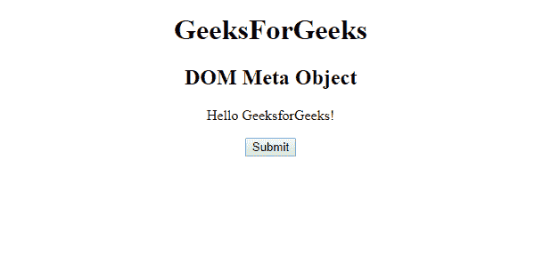
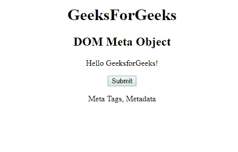
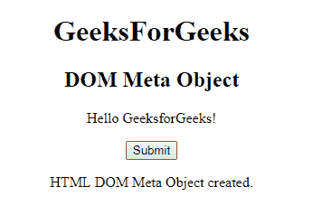

# HTML | DOM 元对象

> 原文:[https://www.geeksforgeeks.org/html-dom-meta-object/](https://www.geeksforgeeks.org/html-dom-meta-object/)

**DOM 元对象**用于表示 HTML [<元>](https://www.geeksforgeeks.org/?p=224850) 元素。元元素通过**获取元素。**
**属性:**

*   [**名称属性**](https://www.geeksforgeeks.org/html-dom-meta-name-property/?ref=rp) **:此属性用于定义属性名称。**
*   [**http-equiv 属性:**](https://www.geeksforgeeks.org/html-dom-meta-httpequiv-property/?ref=rp) 该属性用于获取 http 响应消息头。
*   方案属性:该属性用于指定解释属性值的方案。
*   [**内容属性**](https://www.geeksforgeeks.org/html-dom-meta-content-property/?ref=rp) **:该属性用于指定属性值。**

**语法:**

```html
document.getElementById("ID"); 
```

其中**“id”**是分配给**“meta”**标签的 ID。
**例-1:**

## 超文本标记语言

```html
<!DOCTYPE html>
<html>

<head>
    <meta name="keywords"
          content="Meta Tags, Metadata" />
</head>

<body>
    <center>
        <h1>GeeksForGeeks</h1>
        <h2>DOM Meta Object</h2>

<p>Hello GeeksforGeeks!</p>

        <button onclick="myGeeks()">
          Submit</button>

        <p id="sudo"></p>

        <script>
            function myGeeks() {
                var x =
                document.getElementsByTagName(
                  "META")[0].content;

                document.getElementById(
                  "sudo").innerHTML = x;
            }
        </script>
  </center>
</body>

</html>             
```

**输出:**
**点击按钮前:**



**点击按钮后:**



**示例-2:** 可以使用**文档创建元素方法创建元对象。**

## 超文本标记语言

```html
<!DOCTYPE html>
<html>

<head>
    <title>DOM Meta Object </title>
</head>

<body>
    <center>
        <h1>GeeksForGeeks</h1>
        <h2>DOM Meta Object</h2>

<p>Hello GeeksforGeeks!</p>

        <button onclick="myGeeks()">
          Submit</button>

        <p id="sudo"></p>

        <script>
            function myGeeks() {

                // meta tag created
                var g = document.createElement("META");

                g.setAttribute("name", "keywords");
                g.setAttribute("content",
                               "Meta Tags, Meta data");

                document.head.appendChild(g);

                document.getElementById("sudo").innerHTML =
                  "HTML DOM Meta Object created.";
            }
        </script>
</body>

</html>
```

**输出:**
**点击按钮前:**


**点击按钮后:**



**支持的浏览器:****DOM 元对象**支持的浏览器如下:

*   谷歌 Chrome
*   微软公司出品的 web 浏览器
*   火狐浏览器
*   歌剧
*   旅行队