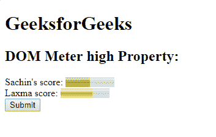
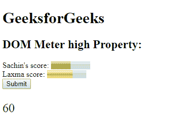
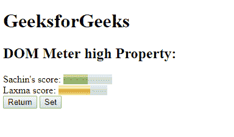
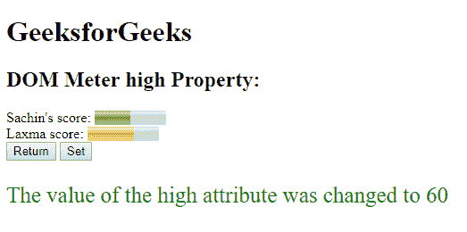
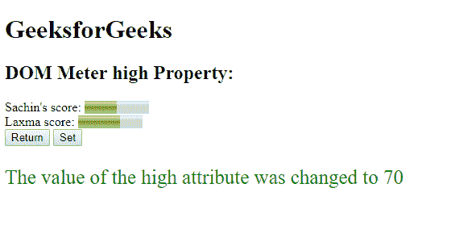

# HTML | DOM 米高属性

> 原文:[https://www.geeksforgeeks.org/html-dom-meter-high-property/](https://www.geeksforgeeks.org/html-dom-meter-high-property/)

**DOM 仪表高属性**用于**设置**或**返回** *仪表中高属性的值*。高属性用于指定仪表值被视为高值的范围。
高值将小于最大属性，但大于最小值和低属性值。
**语法:**

*   它返回高属性。

```html
meterObject.high
```

*   它用于设置高属性。

```html
meterObject.high = number 
```

**属性值:**包含数值即**数**，指定代表高值的浮点数。
**返回值:**返回一个字符串值，代表被认为是高值的浮点数。
**示例-1:** 本示例**设置高属性**。

## 超文本标记语言

```html
<!DOCTYPE html>
<html>

<head>
    <title>
      DOM Meter Object
  </title>
</head>

<body>
    <h1>
      GeeksforGeeks
  </h1>
    <h2>
      DOM Meter high Property:
  </h2> Sachin's score:

    <!-- assigning id to meter with
        properties. -->
    <meter value="5"
           min="0"
           max="10">
        5 out of 10
    </meter>

    <br>Laxma score:

    <!-- meter tag using value property. -->
    <meter id="GFG"
           min="0"
           low="40"
           high="60"
           max="100"
           value="65">
  </meter>
    <br>

    <button onclick="Geeks()">
        Submit
    </button>

    <p id="sudo"
       style="font-size:25px;
              color:green;">
  </p>

    <script>
        function Geeks() {

            // Accessing 'meter' tag.
            var g =
                document.getElementById(
                  "GFG").high;
            document.getElementById(
              "sudo").innerHTML = g;
        }
    </script>

</body>

</html>
```

**输出:**
**点击按钮前:**



**点击按钮后:**



**示例-2:** 本示例**设置高属性**。

## 超文本标记语言

```html
<!DOCTYPE html>
<html>

<head>
    <title>
      DOM Meter Object
  </title>
</head>

<body>
    <h1>
      GeeksforGeeks
  </h1>
    <h2>
      DOM Meter high Property:
  </h2> Sachin's score:

    <!-- assigning id to meter with
        properties. -->
    <meter value="5"
           min="0"
           max="10">
        5 out of 10
    </meter>

    <br>Laxma score:

    <!-- meter tag using value property. -->
    <meter id="GFG"
           min="0"
           low="40"
           high="60"
           max="100"
           value="65">
  </meter>
    <br>

    <button onclick="Geeksr()">
        Return
    </button>
    <button onclick="Geekss()">
        Set
    </button>

    <p id="sudo"
       style="font-size:25px;
              color:green;">
  </p>

    <script>
        function Geekss() {

            // Set 'meter' tag.
            var g =
                document.getElementById(
                  "GFG").high = "70";

            document.getElementById("sudo").innerHTML =
              "The value of the high attribute was changed to "
            + g;
        }

        function Geeksr() {

            // Accessing 'meter' tag.
            var g =
                document.getElementById("GFG").high;
            document.getElementById("sudo").innerHTML =
              "The value of the high attribute was changed to "
            + g;
        }
    </script>

</body>

</html>

```

**输出:**
**初始:**



**点击返回按钮后:**



**点击设置按钮后:**

