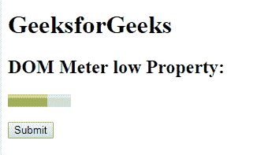
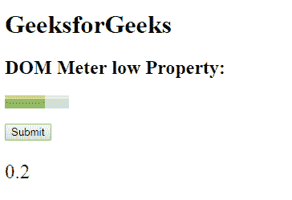
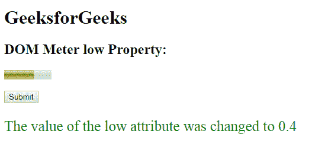

# HTML | DOM 仪表低属性

> 原文:[https://www.geeksforgeeks.org/html-dom-meter-low-property/](https://www.geeksforgeeks.org/html-dom-meter-low-property/)

**DOM 仪表低属性**用于设置或返回仪表中低属性的值。**低属性**用于指定*轨距值被认为低的范围*。低属性的值必须大于**“min”**，小于**“max”**和**“high”**属性。

**语法:**

*   它返回低属性。

    ```html
    meterObject.low
    ```

    *   It is used to set the low property.

    ```html
    meterObject.low = number
    ```

    **返回值:**它返回一个数值，代表一个被认为是低值的浮点数。

    **属性值:**它包含一个值，即**数**，指定被认为是低值的浮点数。

    **示例-1:** 本示例**返回低属性**。

    ```html
    <!DOCTYPE html>
    <html>

    <head>
        <title>
          DOM Meter low Property
      </title>
    </head>

    <body>
        <h1>GeeksforGeeks</h1>
        <h2>DOM Meter low Property:</h2>

        <!-- assigning id to meter with 
            properties. -->
        <meter value="0.6"
               max="0.9"
               min="0.1" 
               id="GFG" 
               optimum="0.6"
               high="0.5" 
               low="0.2">
      </meter>

        <br>
        <br>
        <button onclick="Geeks()">
            Submit
        </button>

        <p id="sudo"
           style="font-size:25px;
                  color:green;">
      </p>

        <script>
            function Geeks() {

                // Accessing 'meter' tag. 
                var g =
                    document.getElementById("GFG").low;
                document.getElementById("sudo").innerHTML =
                  g;
            }
        </script>

    </body>

    </html>
    ```

    **输出:**

    **点击按钮前:**
    

    **点击按钮后:**
    

    **示例-2:** 本示例**设置低属性**。

    ```html
    <!DOCTYPE html>
    <html>

    <head>
        <title>
          DOM Meter low Property
      </title>
    </head>

    <body>
        <h1>
          GeeksforGeeks
      </h1>
        <h2>
          DOM Meter low Property:
      </h2>

        <!-- assigning id to meter with 
            properties. -->
        <meter value="0.6" 
               max="0.9" 
               min="0.1"
               id="GFG"
               optimum="0.6"
               high="0.5"
               low="0.2">
      </meter>

        <br>
        <br>
        <button onclick="Geeks()">
            Submit
        </button>

        <p id="sudo" 
           style="font-size:25px;
                  color:green;">
      </p>

        <script>
            function Geeks() {

                // Accessing 'meter' tag. 
                var g =
                    document.getElementById("GFG").low =
                    "0.4";

                document.getElementById("sudo").innerHTML = 
                  "The value of the low attribute was changed to " 
                + g;
            }
        </script>

    </body>

    </html>
    ```

    **输出:**

    **点击按钮前:**
    

    **点击按钮后:**
    

    **支持的浏览器:**T2 DOM 米低属性支持的浏览器如下:

    *   铬
    *   火狐浏览器
    *   Safari 6.0
    *   歌剧