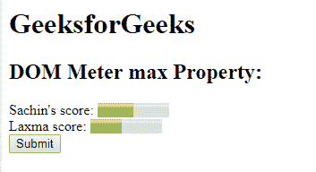
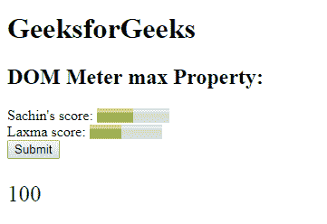
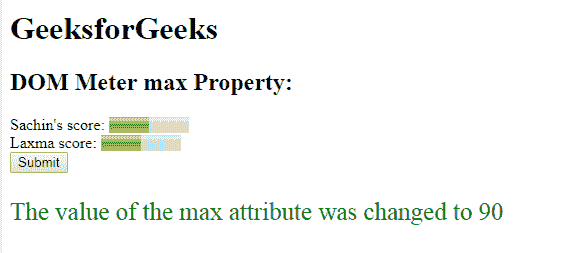

# HTML | DOM 仪表最大属性

> 原文:[https://www.geeksforgeeks.org/html-dom-meter-max-property/](https://www.geeksforgeeks.org/html-dom-meter-max-property/)

**DOM 仪表最大属性**用于**设置**或**返回** *仪表最大属性的值*。max 属性用于指定仪表的上限，max 属性的值必须大于 min 属性的值。它的默认值是 1。

**语法:**

*   它返回 max 属性。

    ```html
    meterObject.max
    ```

*   它用于设置 max 属性。

    ```html
    meterObject.max = number
    ```

**属性值:**它指定了一个代表仪表最大值的浮点数，默认值为 1。

**返回值:**返回一个代表仪表最大值的浮点数。

**示例-1:** 本示例**返回最大属性**。

```html
<!DOCTYPE html>
<html>

<head>
    <title>
      DOM Meter max Property
  </title>
</head>

<body>
    <h1>
      GeeksforGeeks
  </h1>
    <h2>
      DOM Meter max Property:
  </h2> Sachin's score:

    <!-- assigning id to meter with 
        properties. -->
    <meter value="5" 
           min="0" 
           max="10">
        5 out of 10
    </meter>

    <br>Laxma score:

    <!-- meter tag using value property. -->
    <meter id="GFG" 
           min="20" 
           low="40" 
           high="65"
           max="100" 
           value="55">
  </meter>
    <br>

    <button onclick="Geeks()">
        Submit
    </button>

    <p id="sudo" 
       style="font-size:25px;
              color:green;">
  </p>

    <script>
        function Geeks() {

            // Accessing 'meter' tag. 
            var g =
                document.getElementById(
                  "GFG").max;
            document.getElementById(
              "sudo").innerHTML = g;
        }
    </script>

</body>

</html>
```

**输出:**
**点击按钮前:**

**点击按钮后:**


**示例-2:** 本示例**设置最大属性**。

```html
<!DOCTYPE html>
<html>

<head>
    <title>
      DOM Meter max Property
  </title>
</head>

<body>
    <h1>
      GeeksforGeeks
  </h1>
    <h2>
      DOM Meter max Property:
  </h2> Sachin's score:

    <!-- assigning id to meter with 
        properties. -->
    <meter value="5"
           min="0"
           max="10">
        5 out of 10
    </meter>

    <br>Laxma score:

    <!-- meter tag using value property. -->
    <meter id="GFG" 
           min="20" 
           low="40" 
           high="65"
           max="100" 
           value="55">
  </meter>
    <br>

    <button onclick="Geeks()">
        Submit
    </button>

    <p id="sudo" 
       style="font-size:25px;
              color:green;">
  </p>

    <script>
        function Geeks() {

            // Accessing 'meter' tag. 
            var g =
                document.getElementById(
                  "GFG").max = "90";

            document.getElementById(
              "sudo").innerHTML = 
              "The value of the max attribute was changed to "
            + +g;
        }
    </script>

</body>

</html>
```

**输出:**
**点击按钮前:**


**点击按钮后:**


**支持的浏览器:**

*   Mozilla Firefox
*   谷歌 Chrome
*   歌剧
*   旅行队