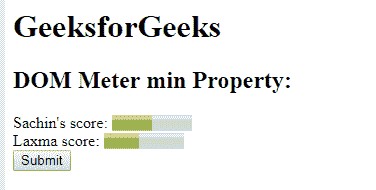

# HTML | DOM 仪表最小属性

> 原文:[https://www.geeksforgeeks.org/html-dom-meter-min-property/](https://www.geeksforgeeks.org/html-dom-meter-min-property/)

**DOM 仪表最小属性**用于**设置**或**返回** *仪表中最小属性的值*。最小值属性用于指定仪表的下限，最小值属性的值必须小于最大值属性的值。
默认值为 0。

**语法:**

*   它返回 min 属性。

    ```html
    meterObject.min
    ```

    *   It is used to set the min property.

    ```html
    meterObject.min = number
    ```

    **属性值:**它包含值，即**数**，指定代表仪表最小值的浮点数。

    **返回值:**返回一个代表仪表最小值的数值。

    **示例-1:** 本示例*返回最小属性*。

    ```html
    <!DOCTYPE html>
    <html>

    <head>
        <title>
          DOM Meter min Property
      </title>
    </head>

    <body>
        <h1>GeeksforGeeks</h1>
        <h2>DOM Meter min Property:</h2> Sachin's score:

        <!-- assigning id to meter with 
            properties. -->
        <meter value="5"
               min="0"
               max="10">
            5 out of 10
        </meter>

        <br>Laxma score:

        <!-- meter tag using value property. -->
        <meter id="GFG"
               min="20" 
               low="40"
               high="65" 
               max="100" 
               value="55">
      </meter>
        <br>

        <button onclick="Geeks()">
            Submit
        </button>

        <p id="sudo"
           style="font-size:25px;
                  color:green;">
      </p>

        <script>
            function Geeks() {

                // Accessing 'meter' tag. 
                var g =
                    document.getElementById("GFG").min;
                document.getElementById("sudo").innerHTML = 
                  g;
            }
        </script>

    </body>

    </html>
    ```

    **输出:**

    **点击按钮前:**
    

    **点击按钮后:**
    

    **示例-2 :** 本示例*返回一个最小属性*。

    ```html
    <!DOCTYPE html>
    <html>

    <head>
        <title>
          DOM Meter min Property
      </title>
    </head>

    <body>
        <h1>
          GeeksforGeeks
      </h1>
        <h2>
          DOM Meter min Property:
      </h2> Sachin's score:

        <!-- assigning id to meter with 
            properties. -->
        <meter value="5"
               min="0"
               max="10">
            5 out of 10
        </meter>

        <br>Laxma score:

        <!-- meter tag using value property. -->
        <meter id="GFG"
               min="20" 
               low="40" 
               high="65"
               max="100"
               value="55">
      </meter>
        <br>

        <button onclick="Geeks()">
            Submit
        </button>

        <p id="sudo"
           style="font-size:25px;
                  color:green;">
      </p>

        <script>
            function Geeks() {

                // Accessing 'meter' tag. 
                var g =
                    document.getElementById("GFG").min = 
                    "10";
                document.getElementById("sudo").innerHTML = 
                  "The value of the min attribute was changed to " 
                + g;
            }
        </script>

    </body>

    </html>
    ```

    **输出:**
    **点击按钮前:**
    
    **点击按钮后:**
    

    **支持的浏览器:****DOM Meter min Property**支持的浏览器如下:

    *   铬
    *   火狐浏览器
    *   Safari 6.0
    *   歌剧