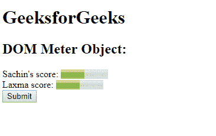
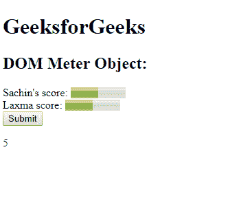
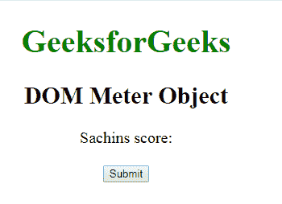
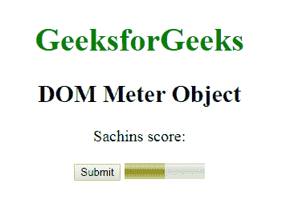

# HTML | DOM 仪表对象

> 原文:[https://www.geeksforgeeks.org/html-dom-meter-object/](https://www.geeksforgeeks.org/html-dom-meter-object/)

**DOM Meter 对象**用于表示 HTML [< meter >](https://www.geeksforgeeks.org/html5-meter-tag/) 元素。*仪表*元素由 **getElementById()** 访问。
**属性:**

*   **形态:**它属于它也属于的一个或多个形态。
*   **max:** 用于指定一个范围的最大值。
*   **min:** 用于指定一个范围的最小值。
*   **高:**用于指定被认为是高值的范围。
*   **低:**用于指定被认为是低的范围值。
*   **最佳:**用于指定范围的最佳值。
*   **值:**用于指定范围的要求值或实际值。

**语法:**

```html
document.getElementById("ID");
```

其中**“id”**是分配给**“米”**标签的 ID。
**例-1:**

## 超文本标记语言

```html
<!DOCTYPE html>
<html>

<head>
    <title>DOM Meter Object</title>
</head>

<body>
    <h1>GeeksforGeeks</h1>
    <h2>DOM Meter Object:</h2> Sachin's score:

    <!-- assigning id to meter with
         properties. -->
    <meter id="GFG"
           value="5"
           min="0"
           max="10">
      5 out of 10
    </meter>

    <br>Laxma score:

    <!-- meter tag using value property. -->
    <meter value="0.5">50% from 100% </meter>
    <br>

    <button onclick="Geeks()">
      Submit
    </button>

    <p id="sudo"></p>

    <script>
        function Geeks() {

            //  Accessing 'meter' tag.
            var g =
             document.getElementById("GFG").value;
            document.getElementById("sudo").innerHTML = g;
        }
    </script>

</body>

</html>                                        
```

**输出:**
**点击按钮前:**



**点击按钮后:**



**示例-2:** 可以使用**文档.创建元素**方法创建仪表对象。

## 超文本标记语言

```html
<!DOCTYPE html>
<html>

<head>
    <title>DOM Meter Object</title>

    <style>
        body {
            font-size: 20px;
        }
    </style>
</head>

<body style="text-align:center;">
    <form>
        <h1 style="color:green">GeeksforGeeks</h1>
        <h2>DOM Meter Object</h2>

        <p id="GFG">Sachins score:</p>

    </form>
    <button onclick="myGeeks()">Submit</button>
    <script>
        function myGeeks() {

            //  Creating meter object using
            //  document.createElement.
            var g = document.createElement("METER");
            g.setAttribute("min", "0");
            g.setAttribute("max", "10");
            g.setAttribute("value", "5");
            document.body.appendChild(g);
        }
    </script>
</body>

</html>
```

**输出:**
**点击按钮前:**



**点击按钮后:**



**支持的浏览器:****DOM Meter 对象**支持的浏览器如下:

*   谷歌 Chrome
*   火狐浏览器
*   歌剧
*   旅行队