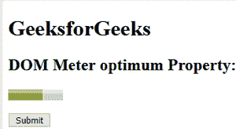
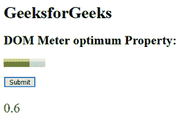
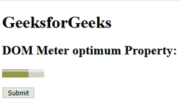
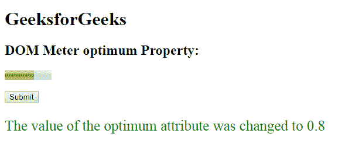

# HTML | DOM 仪表最佳属性

> 原文:[https://www . geesforgeks . org/html-DOM-meter-optimal-property/](https://www.geeksforgeeks.org/html-dom-meter-optimum-property/)

HTML DOM 中的 **DOM 仪表最佳属性**用于**设置**或**返回** *仪表中最佳属性的值*。HTML 中的最佳属性表示仪表的最佳数值。
必须在最小和最大范围内。当它与“低”和“高”属性一起使用时，它会指示沿着范围的哪个位置被认为是优选的。
**语法:**

*   它返回最佳属性。

    ```html
    meterObject.optimum
    ```

*   它用于设置最佳属性。

    ```html
    meterObject.optimum = number
    ```

**属性值:**它包含一个数值，指定作为仪表最佳值的浮点数。
**返回值:**返回一个代表浮点数的数值，该数值是仪表的最佳值。
**示例-1:** 本示例**返回最佳属性**。

```html
<!DOCTYPE html>
<html>

<head>
    <title>
      DOM Meter optimum Property
  </title>
</head>

<body>
    <h1>GeeksforGeeks</h1>
    <h2>
      DOM Meter optimum Property:
  </h2>

    <!-- assigning id to meter with 
        properties. -->
    <meter value="0.6" 
           max="0.9"
           min="0.1" 
           id="GFG" 
           optimum="0.6" 
           high="0.5"
           low="0.2">
  </meter>

    <br>
    <br>
    <button onclick="Geeks()">
        Submit
    </button>

    <p id="sudo" 
       style="font-size:25px;
              color:green;">
  </p>

    <script>
        function Geeks() {

            // Accessing 'meter' tag. 
            var g =
                document.getElementById(
                  "GFG").optimum;

            document.getElementById(
              "sudo").innerHTML = g;
        }
    </script>

</body>

</html>
```

**输出:**
**点击按钮前:**



**点击按钮后:**



**示例-2 :** 本示例**设置最佳属性**。

```html
<!DOCTYPE html>
<html>

<head>
    <title>
      DOM Meter optimum Property
  </title>
</head>

<body>
    <h1>
      GeeksforGeeks
  </h1>
    <h2>
      DOM Meter optimum Property:
  </h2>

    <!-- assigning id to meter with 
        properties. -->
    <meter value="0.6"
           max="0.9"
           min="0.1" 
           id="GFG"
           optimum="0.6"
           high="0.5" 
           low="0.2">
  </meter>

    <br>
    <br>
    <button onclick="Geeks()">
        Submit
    </button>

    <p id="sudo" 
       style="font-size:25px;
              color:green;">
  </p>

    <script>
        function Geeks() {

            // Accessing 'meter' tag. 
            var g =
                document.getElementById(
                  "GFG").optimum = "0.8";

            document.getElementById(
              "sudo").innerHTML = 
              "The value of the optimum attribute"+
              " was changed to " + g;
        }
    </script>

</body>

</html>
```

**输出:**
**点击按钮前:**



**点击按钮后:**



**支持的浏览器:**

*   谷歌 Chrome
*   Mozilla Firefox
*   旅行队
*   歌剧