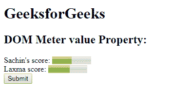

# HTML | DOM 仪表值属性

> 原文:[https://www . geesforgeks . org/html-DOM-meter-value-property/](https://www.geeksforgeeks.org/html-dom-meter-value-property/)

**DOM 仪表值属性**用于**设置**或**返回** *仪表中值属性的值*。value 属性用于指定仪表的当前值。该值应该介于最小值和最大值之间。

**语法:**

*   它返回 value 属性。

    ```html
    meterObject.value
    ```

    *   It is used to set the value property.

    ```html
    meterObject.value = number
    ```

    **属性值:**它包含值，即**号**，它指定了一个代表仪表当前值的浮点数。

    **返回值:**返回一个代表仪表当前值的浮点数。

    **示例:**本示例返回属性值。

    ```html
    <!DOCTYPE html>
    <html>

    <head>
        <title>
          DOM Meter Object
      </title>
    </head>

    <body>
        <h1>GeeksforGeeks</h1>
        <h2>
          DOM Meter value Property:
      </h2> Sachin's score:

        <!-- assigning id to meter with 
            properties. -->
        <meter value="5"
               min="0"
               max="10">
            5 out of 10
        </meter>

        <br>Laxma score:

        <!-- meter tag using value property. -->
        <meter id="GFG" 
               min="0" 
               low="40"
               high="65" 
               max="100"
               value="55">
      </meter>
        <br>

        <button onclick="Geeks()">
            Submit
        </button>

        <p id="sudo" 
           style="font-size:25px;
                  color:green;">
      </p>

        <script>
            function Geeks() {

                // Accessing 'meter' tag. 
                var g =
                    document.getElementById("GFG").value;
                document.getElementById("sudo").innerHTML = g;
            }
        </script>

    </body>

    </html>
    ```

    **输出:**

    **点击按钮前:**
    

    **点击按钮后:**
    

    **示例-2:** 本示例设置属性值。

    ```html
    <!DOCTYPE html>
    <html>

    <head>
        <title>
          DOM Meter Object
      </title>
    </head>

    <body>
        <h1>
          GeeksforGeeks
      </h1>
        <h2>
          DOM Meter value Property:
      </h2> Sachin's score:

        <!-- assigning id to meter with 
            properties. -->
        <meter value="5"
               min="0"
               max="10">
            5 out of 10
        </meter>

        <br>Laxma score:

        <!-- meter tag using value property. -->
        <meter id="GFG"
               min="0"
               low="40" 
               high="65" 
               max="100"
               value="55">
      </meter>
        <br>

        <button onclick="Geeks()">
            Submit
        </button>

        <p id="sudo"
           style="font-size:25px;
                  color:green;">
      </p>

        <script>
            function Geeks() {

                // Accessing 'meter' tag. 
                var g =
                    document.getElementById("GFG").value = "45";

              document.getElementById("sudo").innerHTML = 
                  "The value was changed to " + g;
            }
        </script>

    </body>

    </html>
    ```

    **输出:**
    **点击按钮前:**
    

    **点击按钮后:**
    

    **支持的浏览器:**T2 DOM 米值属性支持的浏览器如下:

    *   铬
    *   火狐浏览器
    *   Safari 6.0
    *   歌剧