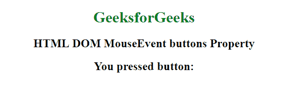
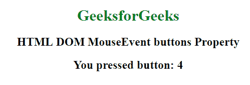

# HTML | DOM 鼠标事件按钮属性

> 原文:[https://www . geesforgeks . org/html-DOM-mouse event-buttons-property/](https://www.geeksforgeeks.org/html-dom-mouseevent-buttons-property/)

鼠标事件的**按钮属性**用于返回一个数字。该数字指示在触发鼠标事件时按下了哪个或哪些鼠标按钮。
该属性通常与 onmousedown 事件一起使用。此属性是只读的。
由于缺乏浏览器支持，可能要改为查看 button 属性。

**语法:**

```html
event.buttons
```

**返回值:**
返回一个代表一个或多个被按下的鼠标按钮的数字。如果按下多个按钮，如左按钮(1)和右按钮(2)，则它返回 3(1+2)。

**可能值:**

*   **1:** 鼠标左键
*   **2:** 鼠标右键
*   **4:** 滚轮按钮或中间按钮
*   **8:** 第四个鼠标按钮或“浏览器后退”按钮
*   **16:** 第五个鼠标按钮或“浏览器前进”按钮

**示例:**

```html
<!DOCTYPE html>
<html>

<head>
    <title>
      HTML DOM MouseEvent buttons Property
  </title>
</head>

<body>
    <center>
        <h1 style="color:green">GeeksforGeeks</h1>
        <div onmousedown="WhichButton(event)">
            <h2>HTML DOM MouseEvent buttons Property</h2>
        </div>

        <h2>You pressed button: <span id="demo"></span></h2>
    </center>
    <script>
        function WhichButton(event) {
            var x = event.buttons;
            document.getElementById("demo").innerHTML = x;
        }
    </script>

</body>

</html>
```

**输出:**
**前:**

**后:**


**支持的浏览器:****鼠标事件按钮属性**支持的浏览器如下:

*   谷歌 Chrome 53.0
*   Internet Explorer 9.0
*   火狐浏览器
*   歌剧