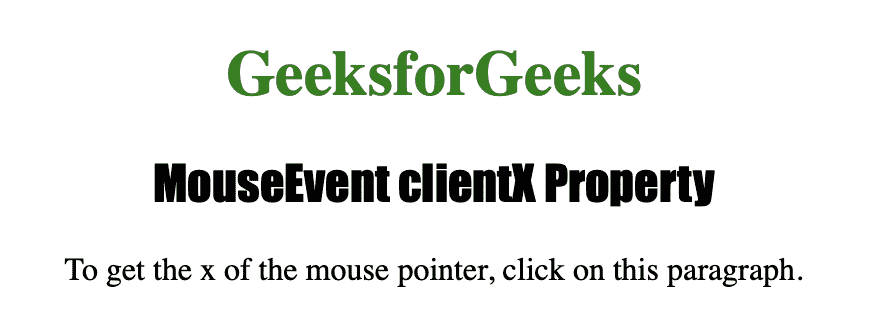
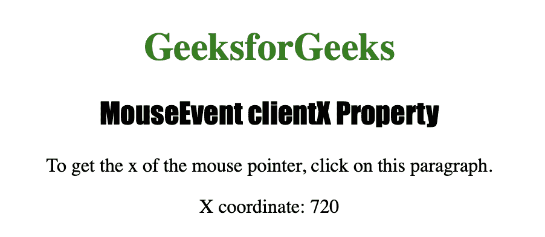

# HTML | DOM MouseEvent clientX 属性

> 原文:[https://www . geesforgeks . org/html-DOM-mouse event-client x-property/](https://www.geeksforgeeks.org/html-dom-mouseevent-clientx-property/)

**MouseEvent clientX** 属性是一个只读属性，用于在鼠标事件被触发时，根据当前窗口返回鼠标指针的水平坐标。

**语法:**

```html
event.clientX
```

**返回值**:返回一个数字，以像素为单位表示鼠标指针的垂直坐标。

下面的程序说明了 MouseEvent clientX 属性:

**在一个元素上点击鼠标按钮，找出鼠标指针的水平坐标。**

```html
<!DOCTYPE html>
<html>

<head>
    <title>MouseEvent clientX Property</title>
    <style>
        h1 {
            color: green;
        }

        h2 {
            font-family: Impact;
        }

        body {
            text-align: center;
        }
    </style>
</head>

<body>

    <h1>GeeksforGeeks</h1>
    <h2>MouseEvent clientX Property</h2>

    <p onclick="coord(event)">To get the x of the mouse pointer,
      click on this paragraph. </p>

    <p id="gfg"></p>

    <script>
        function coord(event) {
            var getXCoord = event.clientX;
            var result = "X coordinate: " + getXCoord;
            document.getElementById("gfg").innerHTML = result;
        }
    </script>

</body>

</html>

```

**输出:**


**点击后段落:**


**支持的网络浏览器:**

*   歌剧
*   微软公司出品的 web 浏览器
*   谷歌 Chrome
*   火狐浏览器
*   苹果 Safari