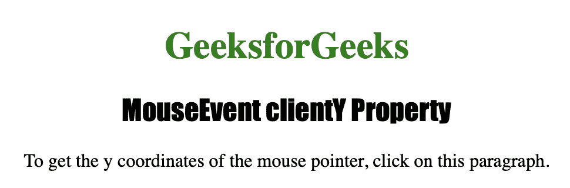
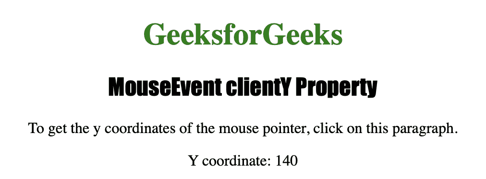

# HTML | DOM MouseEvent 客户端属性

> 原文:[https://www . geesforgeks . org/html-DOM-mouse event-clienty-property/](https://www.geeksforgeeks.org/html-dom-mouseevent-clienty-property/)

MouseEvent **clientY** 属性是一个只读属性，用于在鼠标事件被触发时，根据当前窗口返回鼠标指针的垂直坐标。

**语法:**

```html
event.clientY
```

**返回值:**返回一个数字，以像素为单位表示鼠标指针的垂直坐标。

下面的程序说明了 MouseEvent clientY 属性:

**在一个元素上点击鼠标按钮，找出鼠标指针的垂直坐标。**

```html
<!DOCTYPE html>
<html>

<head>
    <title>MouseEvent clientY Property</title>
    <style>
        h1 {
            color: green;
        }

        h2 {
            font-family: Impact;
        }

        body {
            text-align: center;
        }
    </style>
</head>

<body>

    <h1>GeeksforGeeks</h1>
    <h2>MouseEvent clientY Property</h2>

    <p onclick="coord(event)">
        To get the y coordinates of the mouse pointer,
        click on this paragraph. </p>

    <p id="gfg"></p>

    <script>
        function coord(event) {
            var getYcoord = event.clientY;
            var result = "Y coordinate: " + getYcoord;
            document.getElementById("gfg").innerHTML = result;
        }
    </script>

</body>

</html>

```

**输出:**


**点击**
按钮后

**支持的网络浏览器:**

*   歌剧
*   微软公司出品的 web 浏览器
*   谷歌 Chrome
*   火狐浏览器
*   苹果 Safari