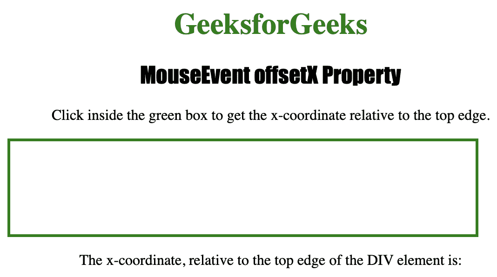
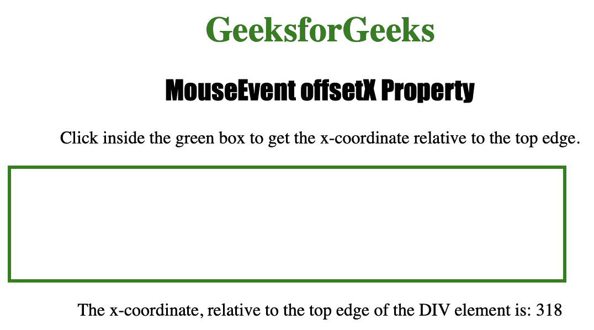

# HTML | DOM MouseEvent offsetX 属性

> 原文:[https://www . geesforgeks . org/html-DOM-mouse event-offsetx-property/](https://www.geeksforgeeks.org/html-dom-mouseevent-offsetx-property/)

**MouseEvent offsetX** 属性是一个只读属性，用于返回鼠标指针相对于目标元素的 **x 坐标。**

**语法:**

```html
event.offsetX
```

**返回值:**返回一个代表鼠标指针水平坐标的数字，以像素为单位。

下面的程序说明了 MouseEvent offsetX 属性:

**示例:**找出鼠标指针相对于 **< div >** 元素的水平坐标。

```html
<!DOCTYPE html>
<html>

<head>
    <title>MouseEvent offsetX Property in HTML</title>
    <style>
        div {
            border: 3px solid green;
            height: 100px;
            width: 500px;
        }

        h1 {
            color: green;
        }

        h2 {
            font-family: Impact;
        }

        body {
            text-align: center;
        }
    </style>
</head>

<body>

    <h1>GeeksforGeeks</h1>
    <h2>MouseEvent offsetX Property</h2>

    <p>Click inside the green box to get 
      the x-coordinate relative to the top edge.</p>

    <div onclick="coord(event)"></div>

    <p>The x-coordinate, relative to 
      the top edge of the DIV element is: 
      <span id="test"></span></p>

    <script>

        function coord(event) {

            var c = event.offsetX;
            document.getElementById(
              "test").innerHTML = c;
        }
    </script>

</body>

</html>
```

**输出:**

*   **点击按钮后:**
    
*   **点击按钮后:**
    

**支持的浏览器:**

*   歌剧
*   微软公司出品的 web 浏览器
*   谷歌 Chrome
*   火狐浏览器
*   苹果 Safari