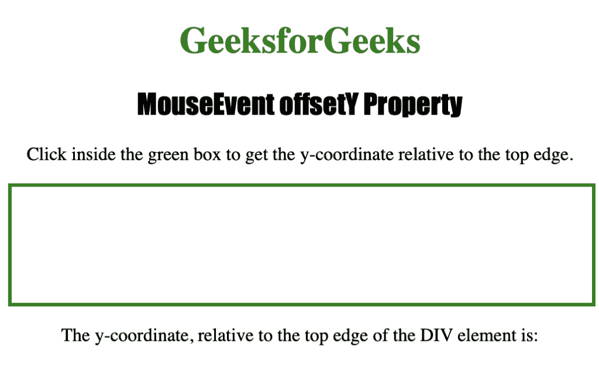
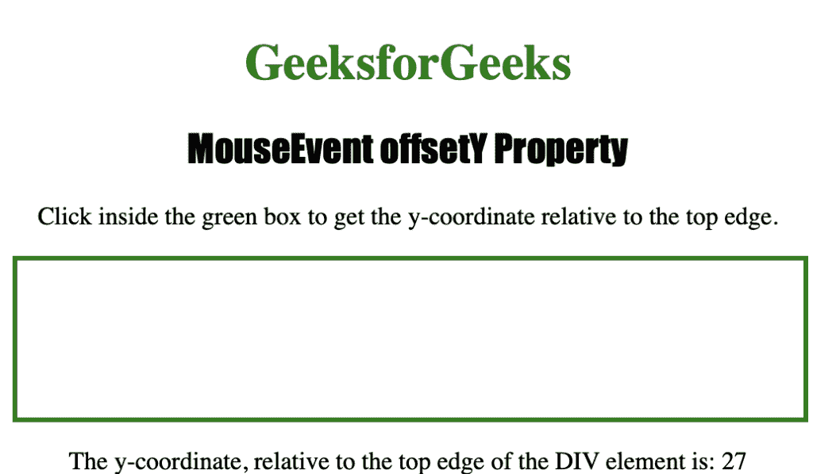

# HTML | DOM mouse event offset 属性

> 原文:[https://www . geesforgeks . org/html-DOM-mouse event-offset-property/](https://www.geeksforgeeks.org/html-dom-mouseevent-offsety-property/)

MouseEvent offsetY 属性是一个只读属性，用于返回鼠标指针相对于目标元素的 y 坐标。

MouseEvent offsetY 属性返回一个数字，代表鼠标指针相对于屏幕的垂直坐标，以像素为单位。

**语法:**

```html
event.offsetY
```

下面的程序说明了 MouseEvent offsetY 属性:

**程序:**找出鼠标指针相对于一个<分区>元素的垂直坐标。

```html
<!DOCTYPE html>
<html>
<head> 
    <title>MouseEvent offsetY Property in HTML</title> 
    <style> 
    div
    {
        border:3px solid green;
        height:100px;
        width:500px;
    }

    h1 
    { 
        color:green; 
    } 

    h2
    {
        font-family: Impact;
    }

    body 
    { 
        text-align:center; 
    }
    </style> 
</head>

<body>
    <h1>GeeksforGeeks</h1> 

    <h2>MouseEvent offsetY Property</h2>

    <p>
        Click inside the green box to get the 
        y-coordinate relative to the top edge.
    </p> 

    <div onclick="coord(event)"></div>

    <p>
        The y-coordinate, relative to the top edge 
        of the DIV element is: 
        <span id="test"></span>
    </p>

    <script>
        function coord(event) 
        {
            var c = event.offsetY;
            document.getElementById("test").innerHTML = c;
        }
    </script>
</body>
</html>                                        
```

**输出:**


**点击**
按钮后

**支持的网络浏览器**

*   歌剧
*   微软公司出品的 web 浏览器
*   谷歌 Chrome
*   火狐浏览器
*   苹果 Safari