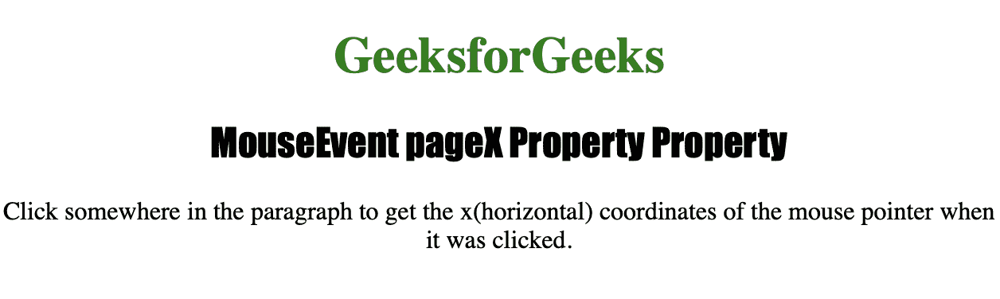
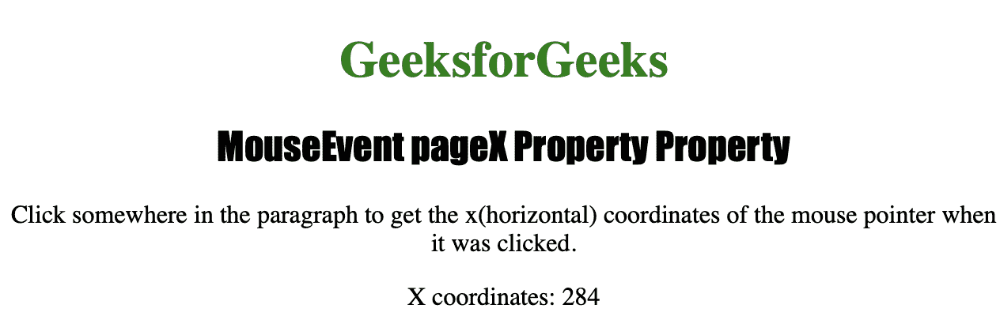

# HTML | DOM MouseEvent pageX 属性

> 原文:[https://www . geesforgeks . org/html-DOM-mouse event-pagex-property/](https://www.geeksforgeeks.org/html-dom-mouseevent-pagex-property/)

**鼠标事件页面**属性是只读属性，用于在事件触发时**返回鼠标指针的水平坐标**。

**语法:**

```html
event.pageX
```

**返回值:**返回一个数字，以像素为单位表示鼠标指针的水平坐标。

下面的程序说明了 MouseEvent pageX 属性:

**示例:**当鼠标按钮点击一个元素时，找出鼠标指针的水平坐标。

```html
<!DOCTYPE html>
<html>

<head>
    <title>MouseEvent pageX Property in HTML</title>
    <style>
        h1 {
            color: green;
        }

        h2 {
            font-family: Impact;
        }

        body {
            text-align: center;
        }
    </style>
</head>

<body>

    <h1>GeeksforGeeks</h1>
    <h2>MouseEvent pageX Property Property</h2>

    <p onclick="coord(event)">
      Click somewhere in the paragraph to get 
      the x(horizontal) coordinates of the 
      mouse pointer when it was clicked.</p>

    <p id="test"></p>

    <script>
        function coord(event) {

            var x = event.pageX;
            var coords = "X coordinates: " + x;
            document.getElementById(
              "test").innerHTML = coords;
        }
    </script>

</body>

</html>
```

**输出:**

*   **点击按钮前:**
    
*   **点击**
    按钮后

**支持的浏览器:**

*   歌剧
*   微软公司出品的 web 浏览器
*   谷歌 Chrome
*   火狐浏览器
*   苹果 Safari