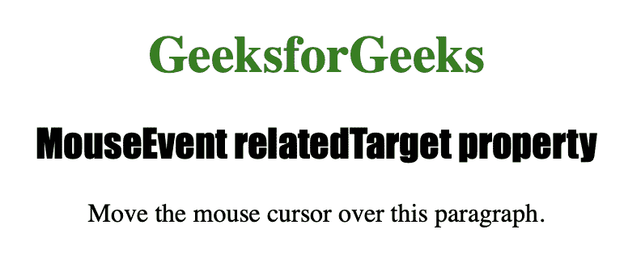
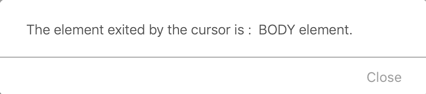

# html | DOM mouse event relatedtarget property

> 原文:[https://www . geesforgeks . org/html-DOM-mouse event-related target-property/](https://www.geeksforgeeks.org/html-dom-mouseevent-relatedtarget-property/)

**MouseEvent relatedTarget 属性**为只读属性，用于返回与**触发鼠标事件**的元素相关的元素。
可用于指示光标刚刚使用**鼠标悬停事件**退出的元素。
也可以用来表示光标刚刚使用 mouseout 事件输入的元素。

**语法**

```html
event.relatedTarget
```

下面的程序说明了 MouseEvent relatedTarget 属性:
**示例-1:获取光标刚刚退出的元素。**

```html
<!DOCTYPE html>
<html>

<head>
    <title>
      MouseEvent relatedTarget property in HTML
   </title>

    <style>
        div {
            border: 3px solid green;
            height: 100px;
            width: 500px;
        }

        h1 {
            color: green;
        }

        h2 {
            font-family: Impact;
        }

        body {
            text-align: center;
        }
    </style>
</head>

<body>

    <h1>GeeksforGeeks</h1>
    <h2>MouseEvent relatedTarget property
    </h2>

    <p onmouseover="mouse(event)">
     Move the mouse cursor over this paragraph.
    </p>

    <script>
        function mouse(event) {

            // Return reference of the element.
            alert(" The element exited by the cursor is :  "
                  + event.relatedTarget.tagName + " element.");
        }
    </script>

</body>

</html>
```

**输出:**

**移过文字前:**


**移过文字后:**


**支持的浏览器:**

*   苹果 Safari
*   歌剧
*   微软公司出品的 web 浏览器
*   谷歌 Chrome
*   火狐浏览器