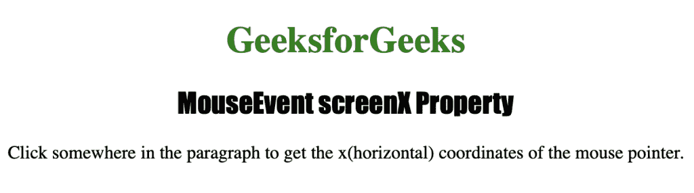
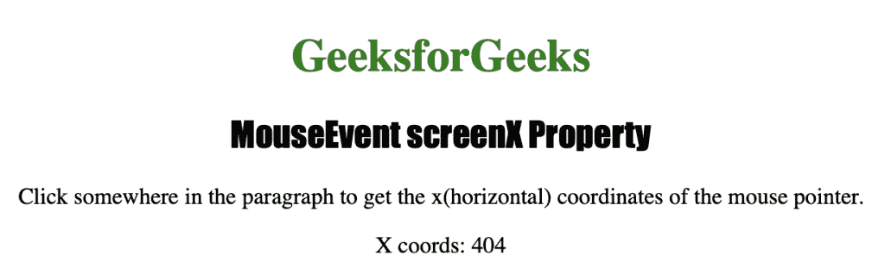

# HTML | DOM MouseEvent screenX 属性

> 原文:[https://www . geesforgeks . org/html-DOM-mouse event-screenx-property/](https://www.geeksforgeeks.org/html-dom-mouseevent-screenx-property/)

每当触发此事件时，鼠标事件 **screenX** 属性用于返回鼠标指针的水平坐标。它返回一个数字，表示鼠标指针相对于屏幕的水平距离(以像素为单位)。

MouseEvent screenX 属性是一个只读属性，它返回一个以像素为单位表示鼠标指针水平坐标的数字。

**语法:**

```html
event.screenX
```

下面的程序说明了 MouseEvent screenX 属性:

**程序:**当鼠标按钮点击一个元素时，找出鼠标指针相对于屏幕的水平坐标。

```html
<!DOCTYPE html>
<html>
<head> 
    <title>MouseEvent screenX Property in HTML</title> 
    <style> 
        h1 
        { 
            color:green; 
        } 

        h2
        {
            font-family: Impact;
        }

        body 
        { 
            text-align:center; 
        }
    </style> 
</head>

<body>
    <h1>GeeksforGeeks</h1> 
    <h2>MouseEvent screenX Property</h2>

    <p onclick="coord(event)">
        Click somewhere in the paragraph to 
        get the x(horizontal) coordinates of 
        the mouse pointer.
    </p>

    <p id="test"></p>

    <script>
        function coord(event) 
        {
            var x = event.screenX;
            var coords = " X coords: " + x;
            document.getElementById("test").innerHTML = coords;
        }
    </script>
</body>
</html>                                      
```

**输出:**


**点击**
按钮后

**支持的网络浏览器**

*   歌剧
*   微软公司出品的 web 浏览器
*   谷歌 Chrome
*   火狐浏览器
*   苹果 Safari