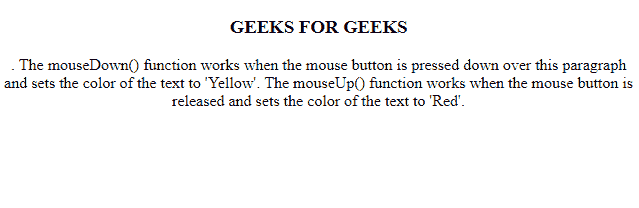
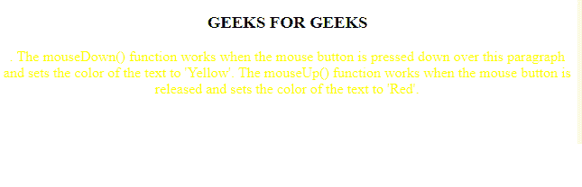
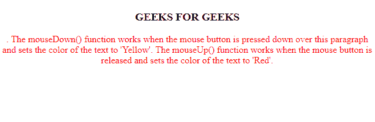

# HTML | DOM MouseEvent

> 哎哎哎:# t0]https://www . geeksforgeeks . org/html-DOM-mouse event/

鼠标与 HTML 文档交互时发生的事件属于 **MouseEvent** 属性的范畴。

**事件类型:**

*   **onclick:** 当用户点击一个元素时，事件发生。
*   **onmousedown:** 当按钮按在元素上时，事件发生。
*   **onmouseenter:** 当指针移动到元素上时，事件发生。
*   **onmouseout:** 当用户将鼠标指针移出某个元素或其子元素时，会发生该事件。
*   **onmouseup:** 当用户在元素上释放鼠标按钮时，事件发生。
*   **oncontextmenu:** 该事件发生在右键单击元素时。
*   **on blclick:**双击元素时会发生此事件。
*   **onmouseleave:** 当指针移出元素时。
*   **onmousemove:** 指针在元素上移动时发生此事件。
*   **onmouseover:** 当指针移动到元素或其子元素上时，会发生此事件。

**语法:**

*   **onmouseup 属性:**

    ```html
    <element onmouseup="ID">
    ```

*   **上城物业:**

    ```html
    <element onmousedown="ID">
    ```

*   **onclick 属性:**

    ```html
    <element onclick="ID">
    ```

*   **oncontextmenu 属性:**

    ```html
    <element oncontextmenu="ID">
    ```

*   **ondblclick 属性:**

    ```html
    <element ondblclick="ID">
    ```

*   **室内物业:**

    ```html
    <element onmouseenter="ID">
    ```

*   **房产:**

    ```html
    <element onmouseleave="ID">
    ```

*   **onmousemove property:**

    ```html
    <element onmousemove="ID">
    ```

*   **onmouseout 属性:**

    ```html
    <element onmouseout="ID">
    ```

*   **onmouseover property:**

    ```html
    <element onmouseover="ID">
    ```

**示例-1:** 下面的程序说明了 **onmousedown** 和 **onmouseup** 属性。

```html
<!DOCTYPE html>
<html>

<body>

  <center>
  <h3>GEEKS FOR GEEKS</h3>
    <p id="myP" onmousedown="mouseDown()" onmouseup="mouseUp()">
        . The mouseDown() function works when the mouse button 
           is pressed down over this paragraph and sets the color of the text to 'Yellow'. 
          The mouseUp() function works when the mouse button is 
            released and sets the color of the text to 'Red'.
    </p>

    <script>
        function onmouseDown() {

            //  using onmousedown property
            document.getElementById("myP").style.color = "yellow"; 
        }

        function mouseUp() {

            //  using onmouseup property
            document.getElementById("myP").style.color = "red"; 
        }
    </script>

  </center>
</body>

</html>
```

**输出:**
**初始:**


**慕斯敦:**


**慕斯贝:**


**支持的浏览器:**

*   谷歌 Chrome
*   Mozilla Firefox
*   边缘
*   歌剧
*   旅行队