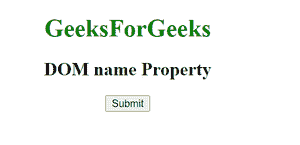

# HTML | DOM 名称属性

> 原文:[https://www.geeksforgeeks.org/html-dom-name-property/](https://www.geeksforgeeks.org/html-dom-name-property/)

DOM 名称属性用于返回属性的名称。它用于只读。
**语法:**

```html
attribute.name 
```

**返回值:**该属性返回一个代表属性名称的字符串值。
**例:**

## 超文本标记语言

```html
<!DOCTYPE html>
<html>

<body>
    <center>
        <h1 style="color:green;">GeeksForGeeks</h1>
        <h2>DOM name Property</h2>

        <button onclick="geeks()">Submit</button>

        <p id="sudo"></p>

        <script>
            function geeks() {
                var btn = document.getElementsByTagName("BUTTON")[0];
                var x = btn.attributes[0].name;
                document.getElementById("sudo").innerHTML = x;
            }
        </script>

</body>

</html>
```

**输出:**

**点击按钮前:**



**点击按钮后:**


**支持的浏览器:**DOM name 属性支持的浏览器如下:

*   苹果 Safari
*   谷歌 Chrome
*   火狐浏览器
*   歌剧
*   微软公司出品的 web 浏览器