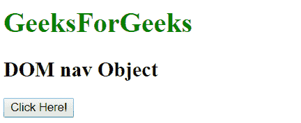

# HTML |DOM 导航对象

> 原文:[https://www.geeksforgeeks.org/html-dom-nav-object/](https://www.geeksforgeeks.org/html-dom-nav-object/)

DOM 导航对象用于表示 HTML nav 元素。

<nav>元素由 getElementById()访问。</nav>

**语法:**

```html
document.getElementById("id") 
```

其中 id 被分配给

<nav>标签。
**注意:**Internet Explorer 8 及更早版本不支持导航对象。
</nav>

**例 1:**

## 超文本标记语言

```html
<!DOCTYPE html>
<html>

<head>
    <title>
        HTML DOM Nav Object
    </title>
</head>

<body>
    <h1>
        GeeksforGeeks
    </h1>

    <h2>HTML DOM nav Object</h2>

    <nav id = "nav_object">
        <a href="#">Data Structure</a> |
        <a href="#">Algorithm</a> |
        <a href="#">Programming Languages</a>
    </nav>

    <br>

    <button onclick = "Geeks()">
        Click Here!
    </button>

    <p id = "sudo"></p>

    <script>
        function Geeks() {
            var obj = document.getElementById("nav_object").innerHTML;
            document.getElementById("sudo").innerHTML = obj;
        }
    </script>
</body>

</html>                   
```

**输出:**
**之前点击按钮:**


**点击按钮后:**


**示例 2:** 可以使用 document.createElement 方法创建导航对象。

## 超文本标记语言

```html
<!DOCTYPE html>
<html>

    <head>
        <title>
            HTML DOM nav Object
        </title>
    </head>
    <body>
        <h1 style = "color:green;" >
            GeeksForGeeks
        </h1>

        <h2>DOM nav Object</h2>

        <button onclick = "Geeks()">
            Click Here!
        </button>

        <br><br>

        <script>
            function Geeks() {
                var ele = document.createElement("NAV");
                document.body.appendChild(ele);

                var a = document.createElement("A");
                a.setAttribute("href", "/html");
                var txt = document.createTextNode("Home");
                a.appendChild(txt);

                ele.appendChild(a);
            }
        </script>
    </body>
</html>                   
```

**输出:**
**之前点击按钮:**



**点击按钮后:**


**支持的浏览器:**

*   谷歌 Chrome
*   边缘
*   Mozilla Firefox
*   歌剧
*   旅行队