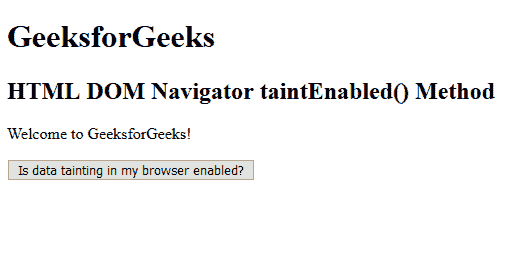

# HTML | DOM 导航器污点启用()方法

> 原文:[https://www . geesforgeks . org/html-DOM-navigator-污点启用-方法/](https://www.geeksforgeeks.org/html-dom-navigator-taintenabled-method/)

在**JavaScript 1.2 版本**中，最好避免使用 **Navigator 污点使能()**方法，并且从那时起已经被弃用，以*防止将来出现运行时错误*。数据污染是一项安全功能，用于销毁或删除 JavaScript 1.2 使用的高传染性数据。到现在已经完全丢弃了；*此方法仅适用于维护与浏览器支持有限的非常旧的脚本*的兼容性。它返回一个布尔值，该值显示浏览器是否启用了数据污染方法。**navigatorid . Tientenabled()**方法总是返回布尔值 false 值。

**语法:**

```html
window.navigator.taintEnabled()

```

**返回值:**
返回一个布尔值，指定浏览器是否启用了数据污染功能。

**示例:**如果支持并启用数据污染，则返回真，如果禁用该功能，则返回假。

```html
<!DOCTYPE html>
<html>

<head>
    <title>
        HTML DOM Navigator taintEnabled() Method
    </title>
</head>

<body>
    <h1>GeeksforGeeks</h1>
    <h2>HTML DOM Navigator taintEnabled() Method
  </h2>

    <p id="geeks"
       onclick="functionGFG()">
        Welcome to GeeksforGeeks!
    </p>
    <input type="button"
           value="Is data tainting in my browser enabled?"
           onClick="functionGFG()">

    <script language="JavaScript">
        function functionGFG() {

            // data tainting is enabled or not.
            var temp = navigator.taintEnabled();
            alert(window.navigator.taintEnabled());
        }
    </script>

</body>

</html>
```

**输出:**
**点击前:**


**点击后:**


**支持的浏览器:**
这个方法早就被弃用了，使用前要小心，因为随时都有可能被收回。尽管已被删除，但以下浏览器仍支持它:

*   歌剧 3.5
*   互联网浏览器 4.0/边缘。