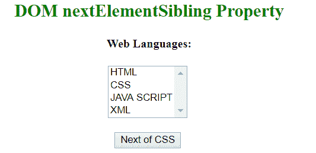
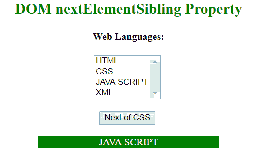

# HTML | DOM next elementsible 属性

> 原文:[https://www . geesforgeks . org/html-DOM-nextelementsibling-property/](https://www.geeksforgeeks.org/html-dom-nextelementsibling-property/)

**next elementsible**属性用于返回指定元素的下一个元素，在同一树级别，如果指定元素是列表中的最后一个元素，则返回 null。它是只读属性。
它不同于*下一个兄弟*属性，因为下一个兄弟将下一个兄弟节点作为元素节点、文本节点或注释节点返回，而*下一个元素兄弟*将下一个兄弟作为元素节点返回(即它忽略文本和注释节点)。

**语法:**

```html
node.nextElementSibling

```

**返回值:**此属性返回指定元素的下一个同级，如果当前元素没有下一个同级，则返回 null。
T3】例:

```html
<!DOCTYPE html>
<html>

<head>
    <title>
      DOM nextSibling Property
    </title>
</head>

<body style="text-align: center">

    <h2 style="color:green;">
      DOM nextElementSibling Property
    </h2>

    <h4 id="h42">Web Languages:</h4>
    <select size="4">
        <option>HTML</option>
        <option id="Select">CSS</option>
        <option>JAVA SCRIPT
        </option>
        <option>XML</option>
    </select>

    <br>
    <br>

    <button onclick="geek()">Next of CSS</button>

    <br>
    <br>

    <p id="p" style="margin:auto; width: 40%"></p>

    <script>
        function geek() {
            var a = 
                document.getElementById("Select").nextElementSibling;
            document.getElementById("p").innerHTML = a.text;
            document.getElementById("p").style.color = "white";
            document.getElementById("p").style.background = "green";
        }
    </script>
</body>

</html>
```

**输出:**
**点击按钮前:**

**点击按钮后:**

**注意:**两个兄弟元素之间不要放空格，否则结果会“未定义”。

**支持的浏览器:**下一个元素兄弟属性支持的浏览器如下:

*   谷歌 Chrome 2.0
*   Internet Explorer 9.0
*   Firefox 3.5
*   opera10.0
*   苹果 Safari 4.0