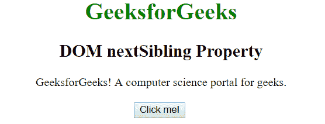
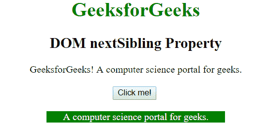

# HTML | DOM 下一个兄弟属性

> 原文:[https://www . geesforgeks . org/html-DOM-next sibling-property/](https://www.geeksforgeeks.org/html-dom-nextsibling-property/)

**nextSibling** 属性用于将指定节点的下一个节点作为 node 对象返回，如果指定节点是列表中的最后一个节点，则返回 null。它是只读属性。
**语法:**

```html
node.nextSibling

```

**返回值:**此属性返回指定节点的下一个同级，如果当前节点没有下一个同级，则返回 null。
T3】例:

```html
<!DOCTYPE html>
<html>

<head>
    <title>
      DOM nextSibling Property
    </title>
</head>

<body style="text-align: center">
    <h1 style="color:green">
      GeeksforGeeks
    </h1>

    <h2>
      DOM nextSibling Property
    </h2>

    <div>
        <span id="p1">
            GeeksforGeeks!
        </span><span id="p2">
          A computer science portal for geeks.
        </span>
    </div>
    <br>

    <button onclick="geek()">Click me!</button>
    <br>
    <br>

    <p id="p" style="margin:auto; width: 40%"></p>

    <script>
        function geek() {
            var x =
                document.getElementById("p1").nextSibling.innerHTML;
                document.getElementById("p").innerHTML = x;
                document.getElementById("p").style.color = "white";
                document.getElementById("p").style.background = "green";
        }
    </script>
</body>

</html>
```

**输出:**
点击按钮前:

点击按钮后:

**注意:**两个兄弟元素之间不要放空格，否则结果会是“未定义”。

**支持的浏览器:**下一个兄弟属性支持的浏览器如下:

*   谷歌 Chrome
*   微软公司出品的 web 浏览器
*   火狐浏览器
*   歌剧
*   旅行队