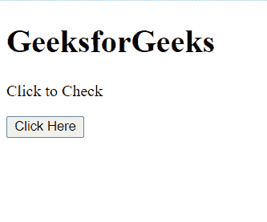
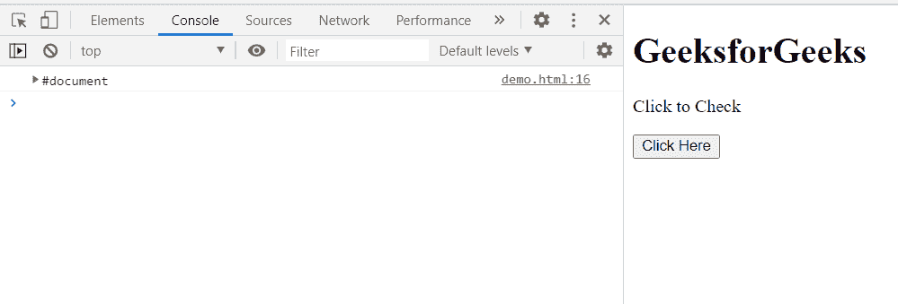

# HTML DOM Node.getRootNode()方法

> 原文:[https://www . geesforgeks . org/html-DOM-node-getrootnode-method/](https://www.geeksforgeeks.org/html-dom-node-getrootnode-method/)

**getRootNode** () **方法**返回**节点对象的根节点**，如果有阴影根，它也可以选择包含阴影根。

**语法:**

```html
var rootNode = node.getRootNode(Composed:boolean);
```

**参数:组成:布尔型(可选)**

*   Composed:一个布尔值，指示是否应该返回阴影根( **false** )，或者阴影根之外的根节点( **true** )。

**返回值:对象的根节点**。

**示例:**本示例展示了如何使用此方法获取对象的根节点。

```html
<!doctype html>
<html>
<head>
    <meta charset="utf-8">
<title>HTML DOM Node getRootNode() method</title>    
</head>
<body>
    <h1>GeeksforGeeks</h1>
    <p>Click to Check</p>
    <button onclick="Check()">Click Here</button>
    <div class="child"></div>
</body>
<script>
    function Check(){
         var child = document.querySelector('.child');
         console.log(child.getRootNode());
        }
</script>
</html>
```

**输出:**

**按钮点击前:**



**按钮点击后:**



**支持的浏览器:**

*   谷歌 Chrome
*   边缘
*   火狐浏览器
*   旅行队
*   歌剧