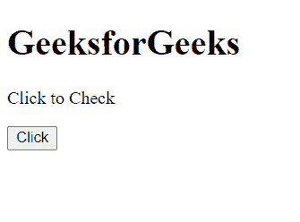
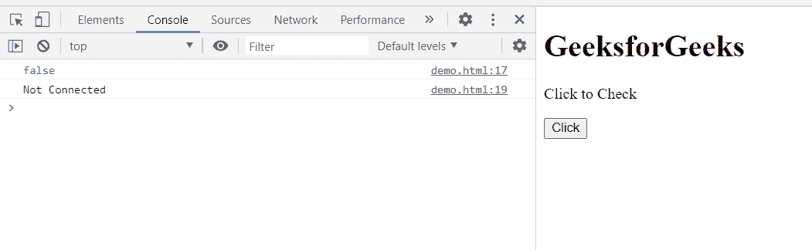
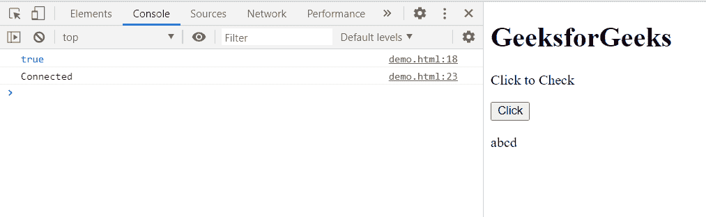

# HTML DOM 节点连接属性

> 原文:[https://www . geesforgeks . org/html-DOM-node-is connected-property/](https://www.geeksforgeeks.org/html-dom-node-isconnected-property/)

**isConnected** 属性返回一个布尔值，该值指示节点是否(直接或间接)连接到上下文对象或文档。这是只读属性。

**语法:**

```html
check = node.isConnected
```

**返回值:**

*   **true:** 如果节点连接到文档。
*   **false:** 如果节点没有连接到文档。

**示例 1:** 该属性返回 false。

## 超文本标记语言

```html
<!DOCTYPE html>
<html>

<head>
    <meta charset="utf-8">
    <title>HTML DOM Node isConnected property</title>
</head>

<body>
    <h1>GeeksforGeeks</h1>

    <p>Click to Check</p>

    <button onclick="Check()">Click</button>

    <script>
        function Check() {
            let exp = document.createElement('p');
            exp.innerHTML = "abcd";
            a = exp.isConnected;
            console.log(a); // Returns false
            if (a == false) {
                console.log("Not Connected");
            }
            else {
                console.log("Connected")
            }
        }
    </script>
</body>

</html>
```

**输出:**

*   **点击按钮前:**

    

*   **点击按钮后:**

    

**示例 2:** 该属性返回 true。

## 超文本标记语言

```html
<!DOCTYPE html>
<html>

<head>
    <meta charset="utf-8">
    <title>HTML DOM Node isConnected property</title>
</head>

<body>
    <h1>GeeksforGeeks</h1>

    <p>Click to Check</p>

    <button onclick="Check()">Click</button>

    <script>
        function Check() {
            let exp = document.createElement('p');
            exp.innerHTML = "abcd";
            document.body.appendChild(exp);
            a = exp.isConnected;
            console.log(a); // Returns true
            if (a == false) {
                console.log("Not Connected");
            }
            else {
                console.log("Connected")
            }
        }
    </script>
</body>

</html>
```

**输出:**

*   **点击按钮前:**

    

*   **点击按钮后:**

    

**支持的浏览器:**

*   谷歌 Chrome
*   边缘
*   火狐浏览器
*   旅行队
*   歌剧