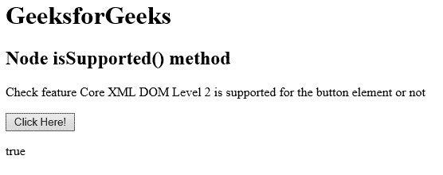

# HTML | DOM 节点问题支持()方法

> 原文:[https://www . geesforgeks . org/html-DOM-node-issupported-method/](https://www.geeksforgeeks.org/html-dom-node-issupported-method/)

HTML DOM 中的 **isSupported()** 方法用于检查指定的特征是否被指定的节点支持。许多浏览器不支持此方法。如果支持该功能，则返回 true，否则返回 false。

**语法:**

```html
node.isSupported(feature, version)
```

**使用的参数:**

*   **特征:**为必输参数，用于定义特征，检查是否支持。
*   **版本:**它是一个可选参数，用于定义要检查是否支持的功能版本。

下面的程序说明了超文本标记语言文档中的节点问题支持()方法:

**示例:**本示例检查<按钮>元素是否支持 Core 2.0 版功能。

```html
<!DOCTYPE html>
<html>

<head> 
    <title> 
        HTML DOM Node isSupported() method
    </title> 
</head>

<body>
    <h1>GeeksforGeeks</h1>

    <h2>Node isSupported() method</h2>

    <p>
        Check feature Core XML DOM Level 2 is
        supported for the button element or not
    </p>

    <button onclick = "myGeeks()">
        Click Here!
    </button>

    <p id = "GFG"></p>

  <script>
      function myGeeks() {
        var item = document.getElementsByTagName("BUTTON")[0];
        var x = item.isSupported("Core", "2.0");
        document.getElementById("GFG").innerHTML = x;
      }
  </script>
</body>

</html>   
```

**输出:**
**之前点击按钮:**

**之后点击按钮:**


**支持的浏览器:**节点支持的浏览器方法如下:

*   Internet Explorer 9.0
*   旅行队