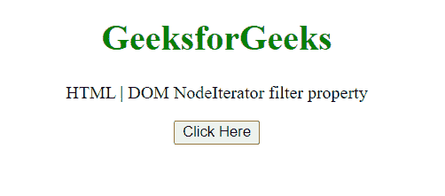
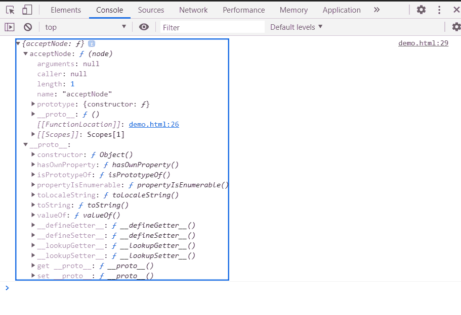

# HTML DOM 节点迭代器过滤器属性

> 原文:[https://www . geesforgeks . org/html-DOM-node iterator-filter-property/](https://www.geeksforgeeks.org/html-dom-nodeiterator-filter-property/)

**节点迭代器过滤器**属性返回一个节点过滤器对象，该对象实现了一个 acceptNode( *节点*)方法，用于筛选节点。

创建节点迭代器时，过滤器对象作为第三个参数在 createNodeIterator()方法中传递，在每个节点上调用对象方法 acceptNode( *node* )来决定是否接受它。这是只读属性。

**语法:**

```html
nodeFilter = nodeIterator.filter;
```

**返回值:**返回一个 NodeFilter 对象。

**示例:**在本例中，我们将创建一个节点迭代器，并将使用该属性获取 NodeFilter 对象。

```html
<!DOCTYPE HTML> 
<html>  
<head>
    <meta charset="UTF-8">
    <title>HTML | DOM NodeIterator filter property</title>
</head>   

<body style="text-align:center;">
    <h1 style="color:green;">  
     GeeksforGeeks
    </h1> 
    <p> 
HTML | DOM NodeIterator filter property
    </p>

    <button onclick = "Geeks()">
    Click Here
    </button>
    <p id="a"></p>
    <script> 
        var a = document.getElementById("a");
        function Geeks(){
           const nodeIterator = document.createNodeIterator(
            document.body,
            NodeFilter.SHOW_ELEMENT,
            { acceptNode: function(node) {
 return NodeFilter.FILTER_ACCEPT; } },
            false
        );
           console.log(nodeIterator.filter);

}
</script>
</body>
</html>
```

**输出:**

**点击按钮前:**



**点击按钮后:**在控制台中，可以看到 NodeFilter 对象。



**支持的浏览器:**

*   谷歌 Chrome
*   边缘
*   火狐浏览器
*   旅行队
*   歌剧
*   微软公司出品的 web 浏览器