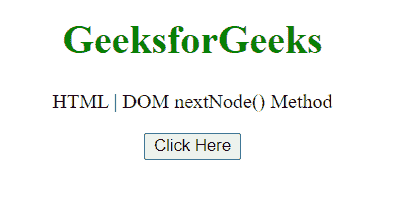
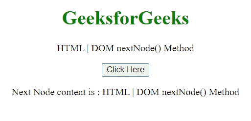
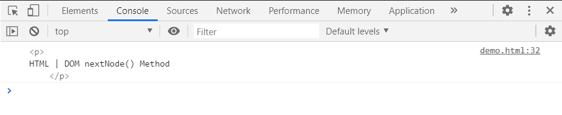

# HTML DOM 节点迭代器 nextNode()方法

> 原文:[https://www . geesforgeks . org/html-DOM-node iterator-next node-method/](https://www.geeksforgeeks.org/html-dom-nodeiterator-nextnode-method/)

**NodeIterator.nextNode()** 方法将 NodeIterator 设置为文档中的下一个节点，并返回 nextNode。nextNode()的第一次调用返回集合中的第一个节点。

当集合中没有剩余节点时，该方法返回 **null** 。

**语法:**

```html
node = nodeIterator.nextNode();
```

**参数:**该方法不取参数。

**返回值:**该方法返回集合中的下一个节点。

**示例:**在本例中，我们将创建一个节点迭代器，因此将使用 nextNode()方法进行迭代。

```html
<!DOCTYPE HTML> 
<html>  
<head>
    <meta charset="UTF-8">
    <title>HTML | DOM nextNode() Method</title>
</head>   

<body style="text-align:center;">
    <h1 style="color:green;">  
     GeeksforGeeks
    </h1> 
    <p> 
HTML | DOM nextNode() Method
    </p>

    <button onclick = "Geeks()">
    Click Here
    </button>
    <p id="a"></p>
    <script> 
        var a = document.getElementById("a");
        function Geeks(){
           const nodeIterator = document.createNodeIterator(
                document.body,
                NodeFilter.SHOW_ELEMENT
                )

            let nextNode=nodeIterator.nextNode();
            nextNode=nodeIterator.nextNode();
            nextNode=nodeIterator.nextNode();
            a.innerHTML =
'Next Node content is : '+nextNode.textContent;
            console.log(nextNode);
}
</script>
</body>
</html>
```

**输出:**

**点击按钮前:**



**点击按钮后:**



**在控制台中:**在控制台中，可以看到下一个节点。



**支持的浏览器:**

*   谷歌 Chrome
*   边缘
*   火狐浏览器
*   旅行队
*   歌剧
*   微软公司出品的 web 浏览器