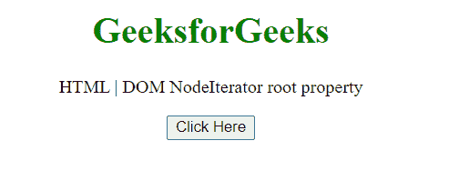
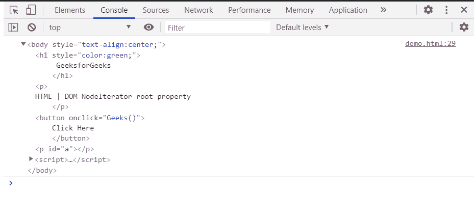

# HTML DOM 节点迭代器根属性

> 原文:[https://www . geesforgeks . org/html-DOM-node iterator-root-property/](https://www.geeksforgeeks.org/html-dom-nodeiterator-root-property/)

节点迭代器 的 **根** 属性返回节点迭代器遍历的根节点。 这是只读属性。

**语法:**

```html
root = nodeIterator.root;
```

**返回值:**返回根节点。

**示例:**在本例中，我们将创建一个节点迭代器，并将使用该属性获取根节点。

## 超文本标记语言

```html
<!DOCTYPE HTML>
<html>

<body style="text-align:center;">
    <h1 style="color:green;">
        GeeksforGeeks
    </h1>

    <p>
        HTML | DOM NodeIterator root property
    </p>

    <button onclick="Geeks()">
        Click Here
    </button>

    <p id="a"></p>

    <script>
        var a = document.getElementById("a");
        function Geeks() {
            const nodeIterator = 
                document.createNodeIterator(
                document.body,
                NodeFilter.SHOW_ELEMENT,
                { acceptNode: function (node) 
                    { return NodeFilter.FILTER_ACCEPT; } },
                false
            );
            console.log(nodeIterator.root);
        }
    </script>
</body>

</html>
```

**输出:**

*   **点击按钮前:**

    

*   **点击按钮后:**在控制台可以看到根节点

    

**支持的浏览器:**

*   谷歌 Chrome
*   边缘
*   火狐浏览器
*   旅行队
*   歌剧
*   微软公司出品的 web 浏览器