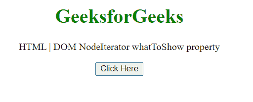
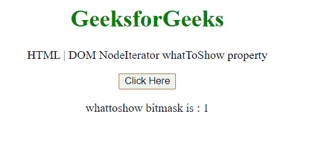

# HTML DOM 节点迭代器 whatToShow 属性

> 原文:[https://www . geesforgeks . org/html-DOM-node iterator-whatoshow-property/](https://www.geeksforgeeks.org/html-dom-nodeiterator-whattoshow-property/)

**节点迭代器 whatToShow** 属性返回一个无符号整数，表示节点迭代器应该返回什么类型的节点的位掩码。这是只读属性。

**语法:**

```html
var nodeTypes = nodeIterator.whatToShow;
```

**返回值:** 返回一个代表位掩码的无符号整数。

可能的返回值:

<figure class="table">

| **恒定** | **返回值** | **常量描述** |
| NodeFilter。全部显示 | one | 显示所有节点。 |
| NodeFilter。显示评论 | One hundred and twenty-eight | 显示注释节点。 |
| NodeFilter。SHOW_DOCUMENT | Two hundred and fifty-six | 显示文档节点。 |
| NodeFilter。SHOW_DOCUMENT_FRAGMENT | One thousand and twenty-four | 显示文档片段节点。 |
| NodeFilter。显示文档类型 | Five hundred and twelve | 显示文档类型节点。 |
| NodeFilter。SHOW_ELEMENT | one | 显示元素节点。 |
| NodeFilter。显示处理指令 | Sixty-four | 显示处理指令节点。 |
| NodeFilter.SHOW_TEXT | four | 显示文本节点。 |

</figure>

**示例:**在本例中，我们将创建一个节点迭代器，并将使用该属性获取该无符号整数。

## 超文本标记语言

```html
<!DOCTYPE HTML>
<html>

<body style="text-align:center;">
    <h1 style="color:green;">
        GeeksforGeeks
    </h1>

    <p>
        HTML | DOM NodeIterator whatToShow property
    </p>

    <button onclick="Geeks()">
        Click Here
    </button>

    <p id="a"></p>

    <script>
        var a = document.getElementById("a");
        function Geeks() {
            const nodeIterator = 
            document.createNodeIterator(
                document.body,
                NodeFilter.SHOW_ELEMENT,
                { acceptNode: function (node) { 
                    return NodeFilter.FILTER_ACCEPT; } },
                false
            );
            a.innerHTML = "whattoshow bitmask is : "
                    + nodeIterator.whatToShow;

        }
    </script>
</body>

</html>
```

**输出:**

*   **点击按钮前:**

    

*   **点击按钮后:**此处为节点过滤器。我们将位掩码无符号整数设为 1。

    

**支持的浏览器:**

*   谷歌 Chrome
*   边缘
*   火狐浏览器
*   旅行队
*   歌剧
*   微软公司出品的 web 浏览器