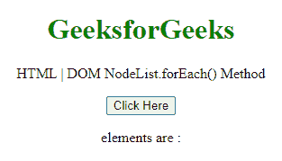
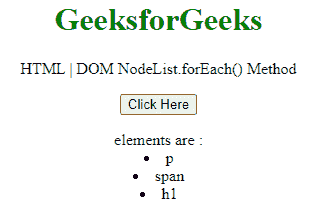
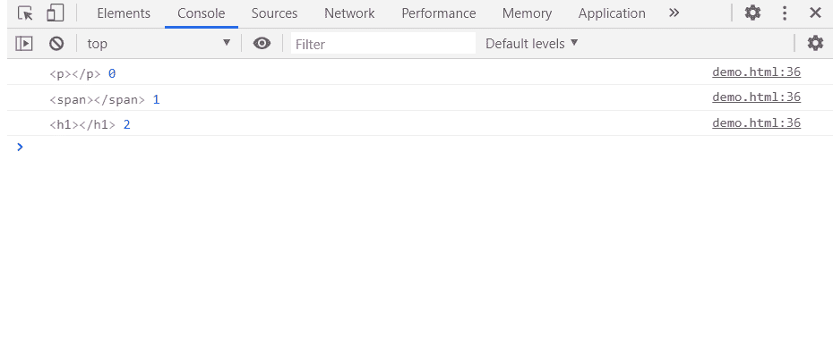

# HTML DOM NodeList.forEach()方法

> 原文:[https://www . geesforgeks . org/html-DOM-nodelist-foreach-method/](https://www.geeksforgeeks.org/html-dom-nodelist-foreach-method/)

NodeList 接口的 **forEach()** 方法按照插入顺序为列表中的每个值对调用一次参数中给出的回调。

**语法:**

```html
NodeList.forEach(callback, currentValue);
```

**参数:**

*   **回调** ***:*** 一个在 NodeList 的每个元素上执行的函数。它接受 3 个参数:
*   **当前值** ***:*** 节点列表中要处理的当前元素。
*   **当前状态(可选):**节点列表中正在处理的**当前值**的索引。
*   **列表对象(可选):**应用 forEach()的节点列表。
*   **该参数(可选):**执行*回调*时用作该参数的值。

**返回值:**此方法返回未定义。

**示例:**在本例中，我们将创建一个节点列表，因此将使用此方法从节点列表中获取所有值。

```html
<!DOCTYPE HTML> 
<html>  
<head>
    <meta charset="UTF-8">
    <title>HTML | DOM NodeList.forEach() Method</title>
</head>   

<body style="text-align:center;">
    <h1 style="color:green;">  
     GeeksforGeeks
    </h1> 
    <p> 
HTML | DOM NodeList.forEach() Method
    </p>

    <button onclick = "Geeks()">
    Click Here
    </button>
    <p id="a"></p>
    <script> 
        var a = document.getElementById("a");
        a.innerHTML = "elements are : "
        function Geeks(){
           var parentNode = document.createElement("div"); 
            var c1 = document.createElement("p"); 
            var c2 = document.createElement("span"); 
            var c3 = document.createElement("h1"); 
            parentNode.appendChild(c1); 
            parentNode.appendChild(c2); 
            parentNode.appendChild(c3); 
            var nodelist = parentNode.childNodes;

           nodelist.forEach( 
            function(currentValue, currentIndex, listObj) {
            a.innerHTML += "<li>"+currentValue.localName + `</li>`;
                console.log(currentValue, currentIndex); 
              },
            );
}
</script>
</body>   
</html>
```

**输出:**

**点击按钮前:**



**点击按钮后:**使用 forEach()调用元素。



在控制台中:可以看到元素值。



**支持的浏览器:**

*   谷歌 Chrome
*   边缘
*   火狐浏览器
*   旅行队
*   歌剧