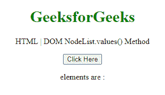
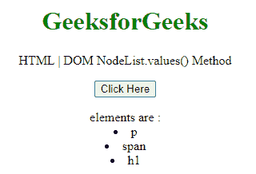
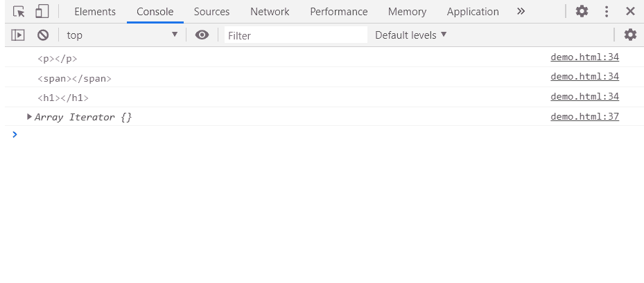

# HTML DOM NodeList.values()方法

> 原文:[https://www . geesforgeks . org/html-DOM-nodelist-values-method/](https://www.geeksforgeeks.org/html-dom-nodelist-values-method/)

**NodeList values()** 方法返回一个迭代器，允许您遍历 NodeList 对象中包含的所有值。这些值是节点对象。

**语法:**

```html
NodeList.values();
```

**参数:**该方法不取参数。

**返回值:**这个方法返回一个迭代器。

**示例:**在这个示例中，我们将创建一个节点列表，因此将获得一个迭代器来使用这个方法从节点列表中获取所有值。

```html
<!DOCTYPE HTML> 
<html>  
<head>
    <meta charset="UTF-8">
    <title>HTML | DOM NodeList.values() Method</title>
</head>   

<body style="text-align:center;">
    <h1 style="color:green;">  
     GeeksforGeeks
    </h1> 
    <p> 
HTML | DOM NodeList.values() Method
    </p>

    <button onclick = "Geeks()">
    Click Here
    </button>
    <p id="a"></p>
    <script> 
        var a = document.getElementById("a");
        a.innerHTML = "elements are : "
        function Geeks(){
           var parentNode = document.createElement("div"); 
            var c1 = document.createElement("p"); 
            var c2 = document.createElement("span"); 
            var c3 = document.createElement("h1"); 
            parentNode.appendChild(c1); 
            parentNode.appendChild(c2); 
            parentNode.appendChild(c3); 
            var nodelist = parentNode.childNodes;

            for(var values of nodelist.values()) { 
               console.log(values); 
               a.innerHTML += "<li>"+values.localName + `</li>`;
            }
            console.log(nodelist.values())
        }
</script>
</body>   
</html>
```

**输出:**

**点击按钮前:**



**点击按钮后:**使用值迭代器调用元素。



**在控制台:**可以看到迭代器值。



**支持的浏览器:**

*   谷歌 Chrome
*   边缘
*   火狐浏览器
*   旅行队
*   歌剧