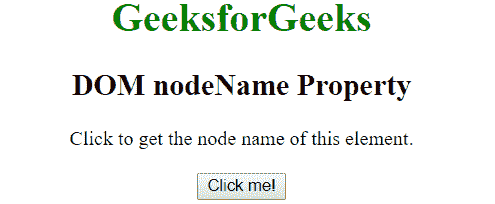
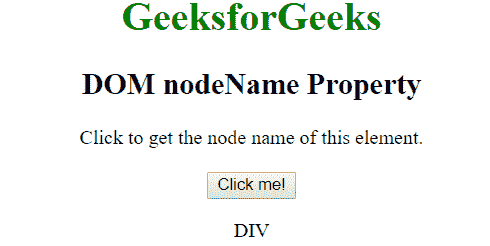

# HTML | DOM 节点名属性

> 原文:[https://www.geeksforgeeks.org/html-dom-nodename-property/](https://www.geeksforgeeks.org/html-dom-nodename-property/)

**节点名称**属性用于以字符串形式返回指定节点的名称。它为不同的节点返回不同的值，例如如果节点属性，则返回的字符串是属性名，或者如果节点是元素，则返回的字符串是标记名。它是只读属性。

**语法:**

```html
document.nodeName
```

**返回值:**该属性返回当前节点的名称。返回值是字符串。

*   对于**元素**节点，返回值是标记名。
*   对于**属性**节点，返回值是属性的名称
*   对于**文档**、**注释**和**文本**节点，返回值分别为“#文档”、“#注释”和“#文本”。

**示例:**

```html
<!DOCTYPE html>
<html>

<head>
    <title>
      DOM nodeName Property
    </title>
</head>

<body onload="start ()" style="text-align: center">
    <h1 style="color:green">
            GeeksforGeeks
        </h1>

    <h2>
            DOM nodeName Property
        </h2>

    <div id="p">
      Click to get the node name of this element.
    </div>
    <br>
    <button onclick="geek()">Click me!</button>

    <p id="p1"></p>

    <script>
        function geek() {
            var x = document.getElementById("p").nodeName;
            document.getElementById("p1").innerHTML = x;
        }
    </script>
</body>

</html>
```

**输出:**
**点击按钮前:**

**点击按钮后:**


**支持的浏览器:***节点名称属性*支持的浏览器如下:

*   谷歌 Chrome
*   微软公司出品的 web 浏览器
*   火狐浏览器
*   歌剧
*   旅行队