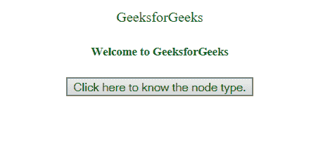
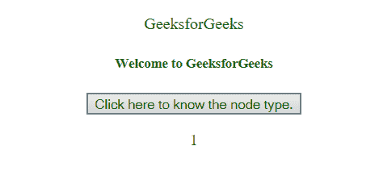
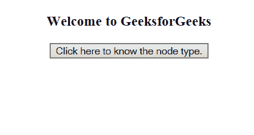
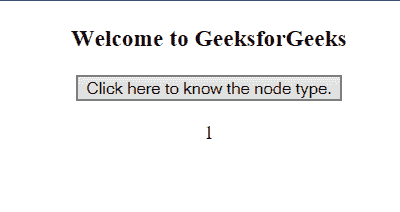

# HTML | DOM 节点类型属性

> 原文:[https://www.geeksforgeeks.org/html-dom-nodetype-property/](https://www.geeksforgeeks.org/html-dom-nodetype-property/)

**DOM 节点类型属性**用于找出我们所指的节点的类型。特定节点的类型以数字形式返回。DOM 节点类型属性是只读属性。

**返回值:**根据节点类型返回一个数值。

*   **1:** 如果节点是元素节点。
*   **2:** 如果节点是属性节点。
*   **3:** 如果节点是文本节点。
*   **8:** 如果节点是注释节点。

**语法:**

```html
 nodeName.nodeType

```

**示例-1:**

```html
<!DOCTYPE html>
<html>

<head>
    <title>
      HTML|DOM nodeType Property
    </title>
    <style>
        p,
        h5 {
            color: green;
        }
    </style>
</head>

<body style="text-align: center;">
    <p id="gfg">
      GeeksforGeeks
    </p>
    <h5>
      Welcome to GeeksforGeeks
    </h5>

    <button onclick="node()">
        Click here to know the node type.
    </button>

    <p id="nodetype"></p>

    <script>
        function node() {
            var geek = document.getElementById("gfg").nodeType;

            // innerHTML fetches value of element 
            // valued "nodetype" 
            // and update it with new value of variable
            // "geek"(nodeType value of geek)
            document.getElementById("nodetype").innerHTML = geek;
        }
    </script>
</body>

</html>
```

**输出:**

**之前:**


**之后:**


**示例-2:**

```html
<!DOCTYPE html>
<html>

<head>
    <title>HTML|DOM nodeType Property</title>
    <style>
        h5 {
            color: green;
        }
    </style>
</head>

<body style="text-align: center;">
    <h3>Welcome to GeeksforGeeks</h3>

    <button onclick="nType()">
        Click here to know the node type.
    </button>

    <p id="nodetype"></p>

    <script>
        // nType() function is used to fetch our node
        // and find out its type 
        function nType() {
            var geek = document.body.nodeType;
            document.getElementById("nodetype").innerHTML = geek;
        }
    </script>
</body>

</html>
```

**输出:**

**之前:**


**之后:**


**支持的浏览器:**

*   谷歌 Chrome
*   微软公司出品的 web 浏览器
*   火狐浏览器
*   歌剧
*   旅行队