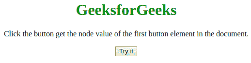
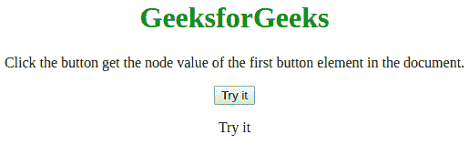

# HTML | DOM 节点值属性

> 原文:[https://www.geeksforgeeks.org/html-dom-nodevalue-property/](https://www.geeksforgeeks.org/html-dom-nodevalue-property/)

HTML DOM **节点值**属性用于描述给定节点的属性。它用于设置或获取任何 Html 文档中的节点值。先决条件 [DOM(文档对象模型)](https://www.geeksforgeeks.org/dom-document-object-model/)
**语法:**

```html
var x = document.getElementById("nodeId").firstChild;
x.nodeType;
x.nodeName;
x.nodeValue;
```

**参数:**
不需要参数。
**返回值:**HTML 节点值属性返回以下类型的值

*   **空:**为元素和文档节点。
*   **属性值:**为任意属性。
*   **内容:**为任意文本节点或评论节点。

**示例:**以下示例创建一个名为**【迪维】**
的段落标记，并提供一个按钮，该按钮生成段落标记属性，并将其值返回给 Id 为“极客 ForGeeks”的标记。

## 超文本标记语言

```html
<!DOCTYPE html>
<html>

<head>
    <title>
        HTML | DOM nodeValue Property
    </title>
</head>

<body>
  <center>
    <h1 style="color:green">GeeksforGeeks</h1>

<p>
      Click the button get the node value of 
      the first button element in the document.
    </p>

    <button onclick="myFunction()">Try it</button>

    <p id="geeks"></p>

    <script>
        function myFunction() {
            var g = document.getElementsByTagName("BUTTON")[0];
            var f = g.childNodes[0].nodeValue;
            document.getElementById("geeks").innerHTML = f;
        }
    </script>
  </center>

</body>

</html>
```

**输出:**
**点击按钮前:**



**点击按钮后:**



**支持的浏览器:**T2 DOM 节点值属性支持的浏览器如下:

*   谷歌 Chrome
*   微软公司出品的 web 浏览器
*   火狐浏览器
*   歌剧
*   旅行队