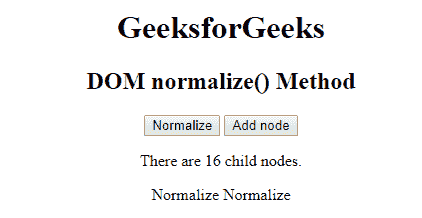

# HTML | DOM normalize()方法

> 原文:[https://www.geeksforgeeks.org/html-dom-normalize-method/](https://www.geeksforgeeks.org/html-dom-normalize-method/)

HTML 中的 **normalize()方法**用于将相邻的文本节点与第一个文本节点合并，并清空空节点。normalize()方法不需要任何参数。

**语法:**

```html
node.normalize()
```

**例 1:**

```html
<!DOCTYPE html>
<html>

<head>
    <title>
        DOM normalize Method
    </title>
</head>

<body onload="normalizeNode()" 
      style="text-align:center">

    <h1>GeeksforGeeks</h1>
    <h2>DOM normalize() Method</h2>

    <button onclick="normalizeNode()">
        Normalize
    </button>

    <button onclick="addNode()">
        Add node
    </button>
    <p>There are <span id="count"></span> child nodes.</p>

    <script>
        // onload is used to reset the child text nodes
        // count when page is refreshed and addNode
        // function is used for addNode button
        function addNode() {

            // Creating a text node named "Normalize"
            var text_node = 
                document.createTextNode("Normalize ");

            // Using variable text_body to 
            //access the whole body
            var text_body = document.body;

            // Adding text node to the end of the body 
            text_body.appendChild(text_node);

            // Count is used to store number of child text
            // nodes present in the document
            var text_node = 
                document.getElementById("count");

            // innerHTML fetches value of text_node and 
            // update it with new value.
            text_node.innerHTML = 
              text_body.childNodes.length;
        }

        // normalizeNode function is used to Normalize button
        function normalizeNode() {
            document.normalize();
            var text_body = document.body;
            var node_count = 
                document.getElementById("count");
            node_count.innerHTML =
                  text_body.childNodes.length;
        }
    </script>
</body>

</html>
```

**输出:**


**支持的浏览器:***DOM normalize()方法*支持的浏览器如下:

*   谷歌 Chrome
*   微软公司出品的 web 浏览器
*   火狐浏览器
*   歌剧
*   旅行队