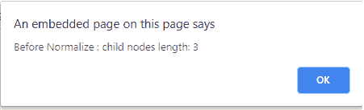
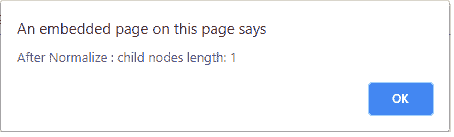

# HTML | DOM normalizeDocument()方法

> 原文:[https://www . geesforgeks . org/html-DOM-normalized document-method/](https://www.geeksforgeeks.org/html-dom-normalizedocument-method/)

HTML 中的 **normalizeDocument()** 方法用于通过移除任何空文本节点(如果存在)来对 HTML 文档进行规范化。移除空节点后，它还会合并文档中存在的所有相邻节点。

**例如**，考虑以下要素:

```html
Element Geeks
    Text node: ""
    Text node: "Hello "
    Text node: "wor"
    Text node: "ld"

```

正常化后的以上元素会变成**“Hello world”**。

**注意:**该方法不被任何浏览器支持，但作为 [DOM normalize()方法](https://www.geeksforgeeks.org/html-dom-normalize-method/)工作并显示输出。

**语法:**

```html
geeknode.normalize()
```

**参数:**

*   The **normalize()** method does not require any parameter.

    **示例:**

    ```html
    <!DOCTYPE html>
    <html>

    <head>
        <meta http-equiv="Content-Type" 
         content="text/html; charset=utf-8" />
        <title>GeeksForGeeks | HTML DOM Normalize Method</title>
    </head>

    <body>
        <script type="text/javascript">
            var parent = document.createElement("div");
            parent.appendChild(document.createTextNode("Child 1 "));
            parent.appendChild(document.createTextNode("Child 2 "));
            parent.appendChild(document.createTextNode("Child 3"));

            // Here the length of parent's child nodes would be 3, 
            // you can check the same
            // using parent.childNodes.length. 
            alert('Before Normalize : child nodes length: ' + 
                  parent.childNodes.length);
            parent.normalize();
            document.body.appendChild(parent);

            // Now, parent.childNodes.length === 1
            // Content of all 3 childs nodes
            // are in one child node only.
            alert('After Normalize : child nodes length: ' + 
                  parent.childNodes.length);
        </script>
    </body>

    </html>
    ```

    **输出:**
    **Normalize()调用前:**
    
    **Normalize()调用后:**
    
    **支持的浏览器:**主要浏览器不支持*DOM normalized document()方法*