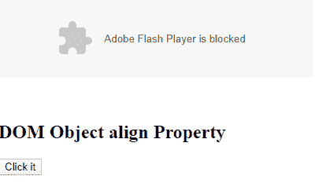
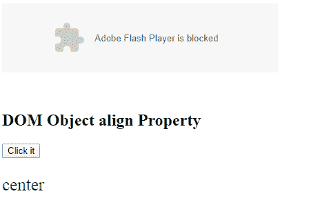
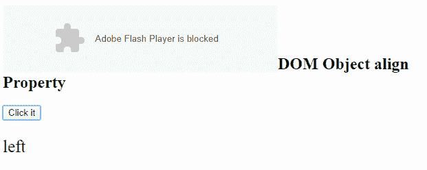

# HTML | DOM 对象对齐属性

> 原文:[https://www . geesforgeks . org/html-DOM-object-align-property/](https://www.geeksforgeeks.org/html-dom-object-align-property/)

**HTML DOM Object align 属性**用于设置或返回元素的数据属性值。

**语法:**

*   它返回对象对齐属性。

```html
objectobject.align;
```

*   它设置对象的对齐属性。

```html
objectobject.align="left | right | middle | top | bottom"
```

**属性值:**

*   **左**:将对象设置为左对齐。
*   **右:**它将对象设置为右对齐。
*   **中间:**它将对象设置为中间。
*   **顶部**:将对象设置为顶部对齐。
*   **底部:**它将对象设置为底部对齐。

**返回值:**返回一个代表对象元素对齐方式的字符串值。
**示例 1:** 本示例返回对象 align 属性。

## 超文本标记语言

```html
<!DOCTYPE html>
<html>

<head>
    <title>
        HTML DOM Object align Property
    </title>
</head>

<body>
    <object id="myobject" data="HelloGeeks.swf"
        width="400" height="100" align ="center"
        form="myGeeks" data=
"https://media.geeksforgeeks.org/wp-content/uploads/geek-8.png">
    </object>

    <br><br><br>

    <h2 align ="left">DOM Object align Property</h2>

    <button onclick="Geeks()">
        Click it
    </button>

    <p id="gfg" style=
        "color:green; font-size:25px;">
    </p>

    <script>
        function Geeks() {

            // Accessing Object element.
            var x =
                document.getElementById(
                    "myobject").align;

            document.getElementById(
                "gfg").innerHTML = x;
        }
    </script>
</body>

</html>
```

**输出:**

*   **点击按钮前:**



*   **点击按钮后:**



**示例 2:** 本示例设置对象对齐属性

## 超文本标记语言

```html
<!DOCTYPE html>
<html>

<head>
    <title>
        HTML DOM Object align Property
    </title>
</head>

<body>
    <object id="myobject" data="HelloGeeks.swf"
        width="400" height="100" align ="center"
        form="myGeeks" data=
"https://media.geeksforgeeks.org/wp-content/uploads/geek-8.png">
    </object>

    <br><br><br>

    <h2 align ="left">DOM Object align Property</h2>

    <button onclick="Geeks()">
        Click it
    </button>

    <p id="gfg" style=
        "color:green; font-size:25px;">
    </p>

    <script>
        function Geeks() {

            // Accessing Object element.
            var x = document.getElementById(
                    "myobject").align = "left";

            document.getElementById(
                    "gfg").innerHTML = x;
        }
    </script>
</body>

</html>
```

**输出:**

*   **点击按钮前:**


*   **点击按钮后:**



**支持的浏览器:****DOM 对象对齐属性**支持的浏览器如下:

*   谷歌 Chrome
*   微软公司出品的 web 浏览器
*   火狐浏览器
*   苹果 Safari
*   歌剧