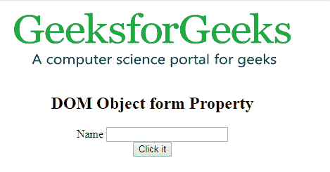
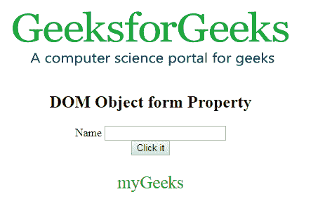

# HTML | DOM 对象表单属性

> 原文:[https://www . geesforgeks . org/html-DOM-object-form-property/](https://www.geeksforgeeks.org/html-dom-object-form-property/)

HTML DOM 中的 **DOM 对象表单属性**用于**设置**或**返回** *一个<对象>元素*的表单属性值。**表单属性**用于指定<对象>将包含的一个或多个表单。

**语法:**

*   它返回窗体属性。

    ```html
    objObject.form
    ```

*   用于设置表单属性:

    ```html
    objObject.form = form_id
    ```

**属性值:**它包含指定对象包含的<表单>元素数量的值，即 form_id。

**返回值**返回一个字符串值，代表一个对象的一个或多个表单元素。

**示例:**本示例返回一个表单属性。

```html
<!DOCTYPE html>
<html>

<body>
    <center>

        <object id="myobject" 
                width="400" 
                height="100"
                name="myGeeks"
                form="myGeeks"
                data=
"https://media.geeksforgeeks.org/wp-content/uploads/geek-8.png">
        </object>

        <h2>DOM Object form Property</h2>
        <form id="myGeeks">
            <label>Name</label>
            <input type="text">
        </form>

        <button onclick="Geeks()">
            Click it
        </button>

        <p id="gfg"
           style="color:green;
                  font-size:25px;">
      </p>
    </center>
    <script>
        function Geeks() {

            // Accessing Object element. 
            var x =
                document.getElementById(
                    "myobject").form.id;

            document.getElementById(
                "gfg").innerHTML = x;
        }
    </script>

</body>

</html>
```

**输出:**

**点击按钮前:**


**点击按钮后:**


**支持的浏览器:****DOM 对象表单属性**支持的浏览器如下:

*   铬
*   火狐浏览器
*   旅行队
*   微软公司出品的 web 浏览器
*   歌剧