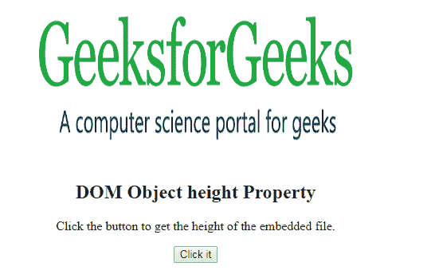
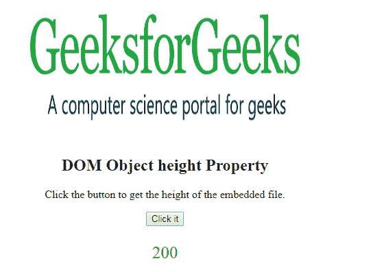
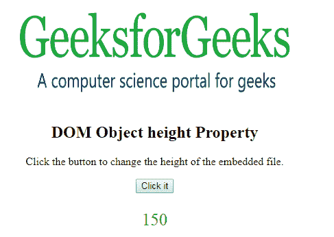

# HTML | DOM 对象高度属性

> 原文:[https://www . geesforgeks . org/html-DOM-object-height-property/](https://www.geeksforgeeks.org/html-dom-object-height-property/)

HTML DOM 中的 **HTML | DOM 对象高度属性**用于**设置**或**返回** *对象的高度*。**高度属性**用于指定对象的高度。

**语法:**

*   它返回高度属性

    ```html
    objObject.height
    ```

*   它用于设置高度属性。

    ```html
    objObject.height = pixels
    ```

**属性值:**它包含值，即**像素**，用于根据像素指定对象的高度。

**返回值:**返回一个数值，代表物体的像素高度。

**示例-1:** 本示例返回高度属性。

```html
<!DOCTYPE html>
<html>

<body>
    <center>
        <object id="myobject"
                width="400" 
                height="200" 
                data=
"https://media.geeksforgeeks.org/wp-content/uploads/geek-8.png">
        </object>
        <h2>DOM Object height Property</h2>
        <p>Click the button to get the 
          height of the embedded file.</p>

        <button onclick="Geeks()">
            Click it
        </button>

        <p id="gfg"
           style="color:green;
                  font-size:25px;">
      </p>
    </center>
    <script>
        function Geeks() {

            // Accessing Object element. 
            var x =
                document.getElementById(
                    "myobject").height;

            document.getElementById(
                "gfg").innerHTML = x;
        }
    </script>

</body>

</html>
```

**输出:**
**点击按钮前:**

**点击按钮后:**


**示例-2:** 本示例设置高度属性。

```html
<!DOCTYPE html>
<html>

<body>
    <center>
        <object id="myobject"
                width="400" 
                height="200" 
                data=
"https://media.geeksforgeeks.org/wp-content/uploads/geek-8.png">
        </object>
        <h2>DOM Object height Property
      </h2>
        <p>Click the button to change 
          the height of the embedded file.</p>

        <button onclick="Geeks()">
            Click it
        </button>

        <p id="gfg" 
           style="color:green;
                  font-size:25px;">
      </p>
    </center>
    <script>
        function Geeks() {

            // Accessing Object element. 
            var x =
                document.getElementById(
                    "myobject").height = "150";

            document.getElementById(
                "gfg").innerHTML = x;
        }
    </script>

</body>

</html>
```

**输出:**
**点击按钮前:**


**点击按钮后:**


**支持的浏览器:**

*   谷歌 Chrome
*   Mozilla Firefox
*   边缘
*   旅行队
*   歌剧