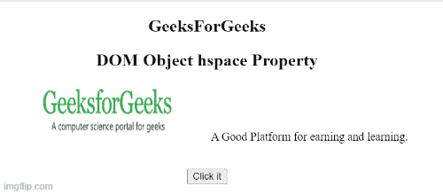

# HTML DOM 对象空间属性

> 原文:[https://www . geesforgeks . org/html-DOM-object-hspace-property/](https://www.geeksforgeeks.org/html-dom-object-hspace-property/)

**HTML DOM Object hspace 属性**用于设置或返回<对象>元素的 **hspace** 属性的值。hpace 属性用于指定对象左侧和右侧的空格数。

**语法**

*   它返回空间属性。

    ```html
    objObject.hspace;
    ```

*   它设置空间属性。

    ```html
    objObject.hspace="pixels";
    ```

**属性值:**它包含指定对象左右两侧空格数量的数值。

**示例 1:** 以下示例返回对象 hspace 属性。

## 超文本标记语言

```html
<!DOCTYPE html>
<html>

<body>
    <center>
        <h2>GeeksForGeeks</h2>

        <h2>DOM Object hspace Property</h2>

        <p> 
            <object id="myobject" width="180" 
                height="78" hspace="50" data=
"https://media.geeksforgeeks.org/wp-content/uploads/geek-8.png">
            </object> 
            A Good Platform for earning and learning.
        </p>

        <br>

        <button onclick="Geeks()">
            Click it
        </button>

        <p id="gfg" style="color:green;font-size:25px;"></p>

    </center>

    <script>
        function Geeks() {

            // Accessing Object element
            var x = vdocument.getElementById("myobject").hspace;

            document.getElementById("gfg").innerHTML = x;
        }
    </script>
</body>

</html>
```

**输出:**



**示例 2:** 以下示例设置对象空间属性。

## 超文本标记语言

```html
<!DOCTYPE html>
<html>

<body>
    <center>
        <h2>GeeksForGeeks</h2>

        <h2>DOM Object hspace Property</h2>

        <p> 
            <object id="myobject" width="180" 
                height="78" hspace="50"
                data=
"https://media.geeksforgeeks.org/wp-content/uploads/geek-8.png">
            </object> 
            A Good Platform for earning and learning.
        </p>
        <br>

        <button onclick="Geeks()">
            Click it
        </button>

        <p id="gfg" style="color:green;font-size:25px;"></p>

    </center>

    <script>
        function Geeks() {

            // Accessing Object element.
            var x = document.getElementById(
                    "myobject").hspace = "15";

            document.getElementById("gfg").innerHTML = x;
        }
    </script>
</body>

</html>
```

**输出:**


**支持的浏览器:**

*   谷歌 Chrome
*   微软公司出品的 web 浏览器
*   歌剧
*   火狐浏览器
*   苹果 Safari