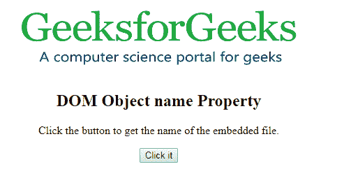
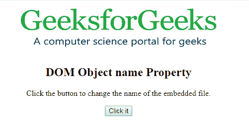
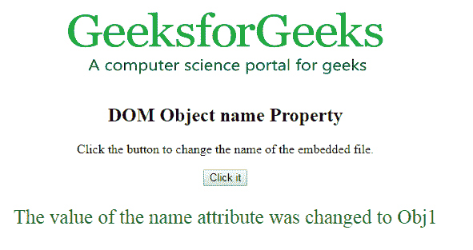

# HTML | DOM 对象名称属性

> 原文:[https://www . geesforgeks . org/html-DOM-object-name-property/](https://www.geeksforgeeks.org/html-dom-object-name-property/)

**HTML | DOM 对象名称属性**用于**设置**或**返回** *一个<对象>元素*的名称属性值。name 属性用于指定嵌入文件的名称。
**语法:**

*   它返回名称属性

```html
objObject.name
```

*   它用于设置 name 属性。

```html
objObject.name = name
```

**属性值:**包含用于指定嵌入文件名称的值，即名称。
**返回值:**返回一个代表<对象>元素名称的字符串值。
**示例-1:** 本示例返回名称属性。

## 超文本标记语言

```html
<!DOCTYPE html>
<html>

<body>
    <center>
        <object id="myobject"
                width="400"
                height="100"
                name="myGeeks"
                data=
"https://media.geeksforgeeks.org/wp-content/uploads/geek-8.png">
      </object>
        <h2>
          DOM Object name Property
      </h2>

<p>
          Click the button to get
          the name of the embedded file.
      </p>

        <button onclick="Geeks()">
            Click it
        </button>

        <p id="gfg"
           style="color:green;
                  font-size:25px;">
      </p>

    </center>
    <script>
        function Geeks() {

            // Accessing Object element.
            var x =
                document.getElementById(
                    "myobject").name;

            document.getElementById(
                "gfg").innerHTML = x;
        }
    </script>

</body>

</html>
```

**输出:**
**点击按钮前:**



**点击按钮后:**


**示例-2:** 本示例设置名称属性。

## 超文本标记语言

```html
<!DOCTYPE html>
<html>

<body>
    <center>
        <object id="myobject"
                width="400"
                height="100"
                name="myGeeks"
                data=
"https://media.geeksforgeeks.org/wp-content/uploads/geek-8.png">
      </object>
        <h2>
          DOM Object name Property
      </h2>

<p>
          Click the button to change
          the name of the embedded file.
      </p>

        <button onclick="Geeks()">
            Click it
        </button>

        <p id="gfg"
           style="color:green;
                  font-size:25px;">
      </p>

    </center>
    <script>
        function Geeks() {

            // Accessing Object element.
            var x =
                document.getElementById(
                    "myobject").name = "Obj1";

            document.getElementById(
                "gfg").innerHTML =
              "The value of the name attribute"+
              " was changed to " + x;
        }
    </script>

</body>

</html>
```

**输出:**
**点击按钮前:**



**点击按钮后:**



**支持的浏览器:**

*   谷歌 Chrome

*   Mozilla Firefox

*   边缘

*   歌剧

*   狩猎