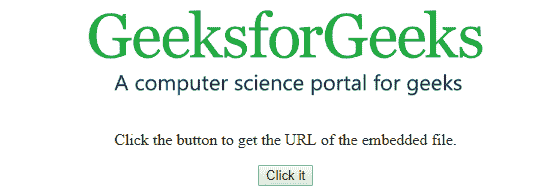
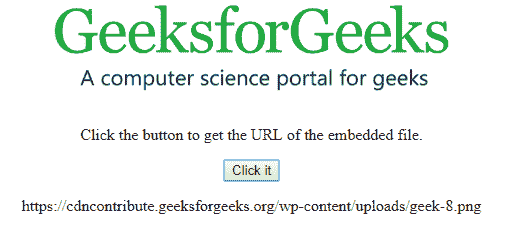
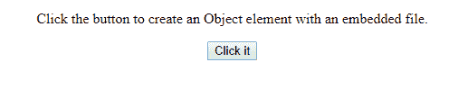
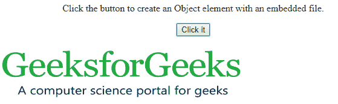

# HTML | DOM 对象对象

> 原文:[https://www.geeksforgeeks.org/html-dom-object-object/](https://www.geeksforgeeks.org/html-dom-object-object/)

**对象**对象只代表 HTML [<对象>](https://www.geeksforgeeks.org/html-object-tag/) 元素。我们可以使用 **getElementById()访问任何<对象>元素；**也可以使用 **createElement()创建对象元素；**方法。
**语法:**

*   **用于访问** ***对象*** **元素**

```html
document.getElementById("id"); 
```

*   **用于创建** ***对象*** **元素**

```html
document.createElement("object");
```

**属性值:**

<figure class="table">

| attribute | explain |
| align | Sets or returns the alignment of the object. |
| place on file | Used to set or return the archive function in the implementation. |
| frame | Useful strings in |
| 代码库 | Sets or returns the URL of the component. |
| data | Sets or returns the URL of the resource. |
| sheet/form | Returns a reference to the parent form. |
| height | The used to set or return the object. |
| name | Set or return the object name. |
| bide one's time | Used to set or return messages when the object is loaded. |
| type | Sets or returns the content type of the downloaded data. |
| Practical map | Its margin |
| width | Sets or returns the width of the object. |

</figure>

**示例-1:** 访问对象元素并返回资源的 URL

## 超文本标记语言

```html
<!DOCTYPE html>
<html>

<body>
    <center>
        <object id="myobject"
                width="400"
data="https://media.geeksforgeeks.org/wp-content/uploads/geek-8.png">
        </object>

<p>Click the button to get
          the URL of the embedded file.</p>

        <button onclick="Geeks()">
          Click it
        </button>

        <p id="gfg"></p>

    </center>
    <script>
        function Geeks() {

            // Accessing Object element.
            var x =
                document.getElementById(
                  "myobject").data;

            document.getElementById(
              "gfg").innerHTML = x;
        }
    </script>

</body>

</html>
```

**输出:**

*   **点击按钮前:**



*   **点击按钮后:**



**示例-2:** 使用**文档创建对象元素。**

## 超文本标记语言

```html
<!DOCTYPE html>
<html>

<body>
    <center>

<p>Click the button to create an
          Object element with an embedded file.</p>

        <button onclick="Geeks()">
          Click it
        </button>

        <p id="gfg"></p>

        <script>
            function Geeks() {

                // Creating object element.
                var x =
                    document.createElement(
                      "OBJECT");

                // Set data of the OBJECT.
                x.setAttribute("data",
"https://media.geeksforgeeks.org/wp-content/uploads/geek-8.png");

                x.setAttribute("width", "400");
                x.setAttribute("height", "100");
                document.body.appendChild(x);
            }
        </script>
    </center>
</body>

</html>
```

**输出:**

*   **点击按钮前:**



*   **点击按钮后:**



**支持的浏览器:**

*   谷歌 Chrome
*   Mozilla Firefox
*   边缘
*   旅行队
*   歌剧