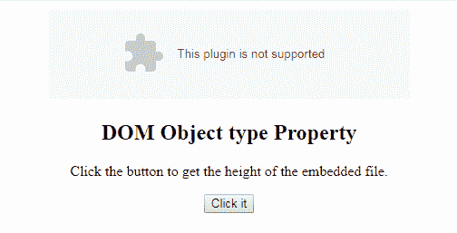

# HTML | DOM 对象类型属性

> 原文:[https://www . geesforgeks . org/html-DOM-object-type-property/](https://www.geeksforgeeks.org/html-dom-object-type-property/)

**HTML | DOM 对象类型属性**用于**设置**或**返回** *一个<对象>元素*的类型属性值。**类型属性**用于指定对象的 MIME 类型的互联网类型。

**语法:**

*   它返回类型属性。

    ```html
    objObject.type
    ```

*   它用于设置类型属性。

    ```html
    objObject.type = media_type 
    ```

**属性值:**包含指定嵌入文件的互联网媒体类型的值，即**媒体类型**。

**返回值:**返回一个字符串值，代表嵌入文件的互联网媒体类型。

**示例:**本示例返回类型属性。

```html
<!DOCTYPE html>
<html>

<body>
    <center>
        <object id="myobject" 
                width="400"
                height="100" 
                data=
"https://media.geeksforgeeks.org/wp-content/uploads/geek-8.png" 
                type="application/vnd.adobe.flash-movie">
      </object>

        <h2>DOM Object type Property</h2>
        <p>Click the button to get the
          height of the embedded file.</p>

        <button onclick="Geeks()">
            Click it
        </button>

        <p id="gfg"
           style="color:green;
                  font-size:25px;">
      </p>
    </center>
    <script>
        function Geeks() {

            // Accessing Object element. 
            var x =
                document.getElementById(
                    "myobject").type;

            document.getElementById(
                "gfg").innerHTML = x;
        }
    </script>

</body>

</html>
```

**输出:**
**点击按钮前:**

**点击按钮后:**


**支持的浏览器:**

*   谷歌 Chrome
*   Mozilla Firefox
*   边缘
*   旅行队
*   歌剧