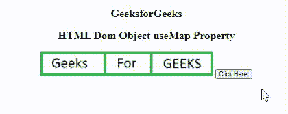

# HTML DOM 对象使用映射属性

> 原文:[https://www . geesforgeks . org/html-DOM-object-usemap-property/](https://www.geeksforgeeks.org/html-dom-object-usemap-property/)

HTML DOM 对象 usemap 属性用于设置或返回 [<对象>](https://www.geeksforgeeks.org/html-dom-html-object/) 元素的 useMap 属性的值。<对象> usemap 属性用于指定与对象一起使用的图像映射的名称。带有可点击区域的图像称为图像地图。useMap 属性与<贴图>元素的名称属性相关联，并在对象和贴图之间创建关系。

**语法**

*   它用于返回 useMap 属性。

```html
***objOb***ject.useMap
```

*   它用于设置用户映射属性。

```html
objObject.useMap = #mapname
```

**属性值**

*   **#地图名称:**用于保存包含哈希(#)字符的地图名称。

**返回值:**如果包含哈希字符(“#”)，它将返回一个字符串值，该值代表<对象>元素的 usemap 属性的值。

**示例 1:** 下面的代码返回一个 useMap 属性。

## 超文本标记语言

```html
<!DOCTYPE html>
<html>

<body style="text-align: center">
    <h2>GeeksforGeeks</h2>
    <h2>HTML Dom Object useMap Property</h2>
    <object id="mygeeks" data=
"https://media.geeksforgeeks.org/wp-content/uploads/a1-25.png"
        usemap="#Geeks1">
    </object>

    <button onclick="GFG()">
        Click Here!
    </button>

    <map name="Geeks1">
        <area id="Geeks" shape="rect" 
            coords="0, 0, 110, 100" alt="Geeks">
    </map>

    <p id="GEEK!"></p>

    <script>
        function GFG() {

            // Return value of usemap attribute
            var x = document.getElementById("mygeeks").useMap;
            document.getElementById("GEEK!").innerHTML = x;
        }
    </script>
</body>

</html>
```

**输出:**



**支持的浏览器:**

*   谷歌 Chrome
*   微软边缘
*   火狐浏览器
*   歌剧
*   旅行队