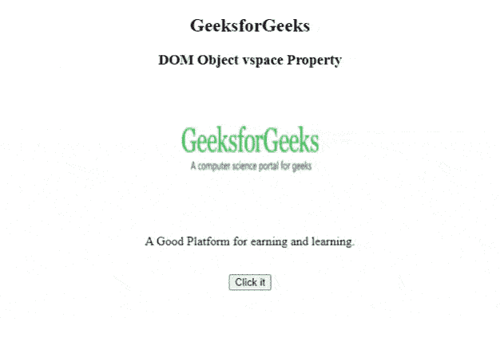

# HTML DOM 对象空间属性

> 原文:[https://www . geesforgeks . org/html-DOM-object-vspace-property/](https://www.geeksforgeeks.org/html-dom-object-vspace-property/)

**HTML DOM Object*****vs pace*****属性**用于设置或返回对象元素的***vs pace*****属性的值。***vs space*****属性用于指定对象顶部和底部的空白数量。****

******语法******

****它返回对象 *vspace* 属性。****

```html
**objObject.vspace;** 
```

****它设置对象 *vspace* 属性。****

```html
**objObject.hspace="pixels".**
```

******属性值:**它包含数字值，以像素为单位表示顶部和底部的空白空间数量。****

******示例 1:** 本示例返回 *vspace* 属性。****

## ****超文本标记语言****

```html
**<!DOCTYPE html>
<html>

<body>
    <center>
        <h2>GeeksforGeeks</h2>

        <h3>DOM Object vspace property</h3>

        <object id="myobject" width="180" height="78" vspace="50"
data="https://media.geeksforgeeks.org/wp-content/uploads/geek-8.png">
        </object>

        <p>A Good Platform for earning and learning.</p>
        <br>

        <button onclick="btnclick1()">
            Click it
        </button>

        <p id="paraID" style="color:green;font-size:25px;"></p>

    </center>

    <script>
        function btnclick1() {

            // Accessing Object element
            var x = document.getElementById("myobject").vspace;
            document.getElementById("paraID").innerHTML = x;
        }
    </script>
</body>

</html>**
```

******输出:******

********

******示例 2:** 本示例设置对象 *vspace* 属性。****

## ****超文本标记语言****

```html
**<!DOCTYPE html>
<html>

<body>
    <center>
        <h2>GeeksforGeeks</h2>

        <h3>DOM Object vspace Property</h3>

        <object id="myobject" width="180" height="78" vspace="50"
data="https://media.geeksforgeeks.org/wp-content/uploads/geek-8.png">
        </object>

        <p>A Good Platform for earning and learning.</p>
        <br>

        <button onclick="btnclick1()">
            Click it
        </button>

        <p id="paraID" style="color:green;font-size:25px;"></p>

    </center>

    <script>
        function btnclick1() {

            // Accessing Object element
            var x = document.getElementById("myobject").vspace = "5";
            document.getElementById("paraID").innerHTML = x;
        }
    </script>
</body>

</html>**
```

******输出:******

********

******注意:**html 5 不支持。****