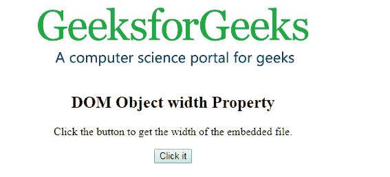
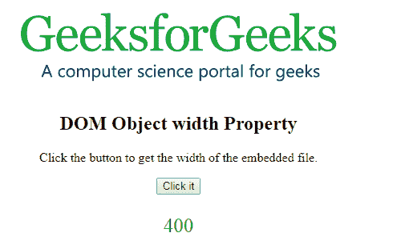
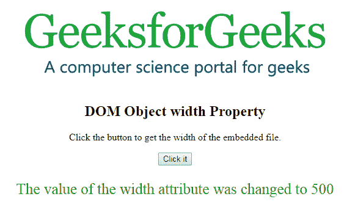

# HTML | DOM 对象宽度属性

> 原文:[https://www . geesforgeks . org/html-DOM-object-width-property/](https://www.geeksforgeeks.org/html-dom-object-width-property/)

HTML DOM 中的 **DOM 对象宽度属性**用于**设置**或**返回** *对象的宽度*。**宽度属性**用于指定对象的宽度。

**语法:**

*   它返回 width 属性。

```html
objObject.width
```

*   它用于设置 width 属性。

```html
objObject.width = pixels
```

**属性值:**它包含值，即**像素**，以像素为单位指定对象的宽度。

**返回值:**返回一个数值，代表物体的像素宽度。

**示例-1:** 本示例返回宽度属性。

## 超文本标记语言

```html
<!DOCTYPE html>
<html>

<body>
    <center>
        <object id="myobject"
                width="400"
                data=
"https://media.geeksforgeeks.org/wp-content/uploads/geek-8.png">
        </object>
        <h2>
          DOM Object width Property
      </h2>

<p>
          Click the button to get
          the width of the embedded file.
      </p>

        <button onclick="Geeks()">
            Click it
        </button>

        <p id="gfg"
           style="color:green;
                  font-size:25px;">
      </p>

    </center>
    <script>
        function Geeks() {

            // Accessing Object element.
            var x =
                document.getElementById(
                    "myobject").width;

            document.getElementById(
                "gfg").innerHTML = x;
        }
    </script>

</body>

</html>
```

**输出:**

**点击按钮前:**



**点击按钮后:**



**示例-2:** 本示例设置宽度属性。

## 超文本标记语言

```html
<!DOCTYPE html>
<html>

<body>
    <center>
        <object id="myobject"
                width="400"
                data=
"https://media.geeksforgeeks.org/wp-content/uploads/geek-8.png">
        </object>
        <h2>
          DOM Object width Property
      </h2>

<p>
          Click the button to get
          the width of the embedded file.
      </p>

        <button onclick="Geeks()">
            Click it
        </button>

        <p id="gfg"
           style="color:green;
                  font-size:25px;">
      </p>

    </center>
    <script>
        function Geeks() {

            // Accessing Object element.
            var x =
                document.getElementById(
                    "myobject").width = "500";

            document.getElementById(
                "gfg").innerHTML =
              "The value of the width "+
              "attribute was changed to " + x;
        }
    </script>

</body>

</html>
```

**输出:**

**点击按钮前:**


**点击按钮后:**



**支持的浏览器:**

*   谷歌 Chrome
*   Mozilla Firefox
*   边缘
*   旅行队
*   歌剧