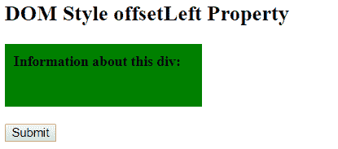
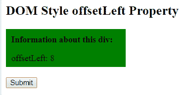

# HTML | DOM offsetLeft 属性

> 原文:[https://www.geeksforgeeks.org/html-dom-offsetleft-property/](https://www.geeksforgeeks.org/html-dom-offsetleft-property/)

**DOM offsetLeft 属性**用于以像素为单位返回左侧位置。该位置相对于 offsetParent 元素的左侧。

**语法:**

```html
element.offsetLeft
```

**返回值:**以像素为单位返回表示元素左边位置的数字。

**示例:**

```html
<!DOCTYPE html> 
<html> 
    <head> 
        <title>
            DOM offsetLeft Property
        </title> 

        <style>
            #GFG {
                height: 50px;
                width: 200px;
                padding: 10px;
                background-color: green;
            }
        </style>
    </head> 

    <body> 
        <h2>
            DOM Style offsetLeft Property
        </h2>     

        <div id = "GFG">
            <b>Information about this div:</b><br>

            <p id = "demo"></p>
        </div><br>

        <button type = "button" onclick = "geeks()"> 
            Submit 
        </button> 

        <script> 
            function geeks() { 
                var testDiv = document.getElementById("GFG");

                document.getElementById("demo").innerHTML
                    = "offsetLeft: "+ testDiv.offsetLeft;
            } 
        </script> 
    </body> 
</html>                    
```

**输出:**
**点击按钮前:**

**点击按钮后:**


**支持的浏览器:**T2 DOM offset 属性支持的浏览器如下:

*   谷歌 Chrome
*   Internet Explorer 8.0
*   火狐浏览器
*   歌剧
*   旅行队