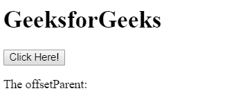
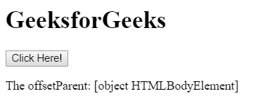

# HTML | DOM offsetParent 属性

> 原文:[https://www . geesforgeks . org/html-DOM-offset parent-property/](https://www.geeksforgeeks.org/html-dom-offsetparent-property/)

在 HTML 中， **offsetParent 属性**用于返回元素的**最近祖先**。返回的祖先必须有一个非静态的位置。如果元素设置为 **display="none"** ，则 offestParent 属性返回空值。

**语法:**

```
object.offsetParent;

```

此属性用于返回元素的偏移量。此方法没有默认值。offsetParent 是一个有用的属性，因为 offsetTop 和 offsetLeft 是相对于其填充边缘的。

**示例 1:** 本示例返回 offsetParent 属性。

```
<!DOCTYPE html>
<html>

<head>
    <title>
        HTML DOM Element offsetParent Property
    </title>
</head>

<body>
    <div id = "GFG">
        <h1>GeeksforGeeks</h1>

        <button onclick="myGeeks()">
            Click Here!
        </button>

        <p>The offsetParent: 
            <span id="geeks"></span>
        </p>
    </div>

    <!-- Script to return the offset parent -->
    <script>
        function myGeeks() {

            // Return offset parent of div
            var offsetp =
                document.getElementById("GFG");

            document.getElementById("geeks").innerHTML = 
                offsetp.offsetParent;
        }
    </script>

</body>

</html>                           
```

**输出:**
**点击按钮前:**


**点击按钮后:**


**示例 2:** 本示例使用 display 属性隐藏 offsetParent 值。

```

<!DOCTYPE html>
<html>

<head>
    <title>
        HTML DOM Element offsetParent Property
    </title>
    <style>
        #GFG {
            display: none;
        }
    </style>
</head>

<body>
    <div id = "g4g">
        <h1 id = "GFG">GeeksforGeeks</h1>

        <button onclick="myGeeks()">
            Click Here!
        </button>

        <p>The offsetParent: 
            <span id="geeks"></span>
        </p>
    </div>

    <!-- Script to return the offset parent -->
    <script>
        function myGeeks() {

            // Return offset parent of div
            var offsetp =
                document.getElementById("GFG");

            document.getElementById("geeks").innerHTML = 
                offsetp.offsetParent;
        }
    </script>

</body>

</html>                     
```

**输出:**
**点击按钮前:**


**点击按钮后:**


**支持的浏览器:**

*   谷歌 Chrome
*   微软公司出品的 web 浏览器
*   火狐浏览器
*   歌剧
*   旅行队