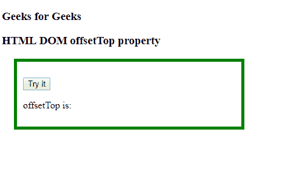
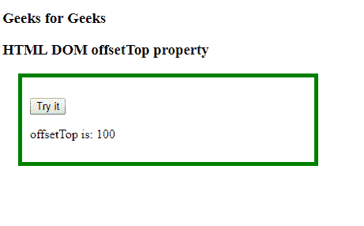

# HTML | DOM 偏移属性

> 原文:[https://www.geeksforgeeks.org/html-dom-offsettop-property/](https://www.geeksforgeeks.org/html-dom-offsettop-property/)

**DOM offsetTop** 属性用于返回相对于 offsetParent 元素顶部的顶部位置。

**语法:**

```html
object.offsetTop
```

**返回值:**

*   以像素为单位的数字表示元素的顶部位置。

**示例:**

## 超文本标记语言

```html
<!DOCTYPE html>
<html>

<head>
    <style>
        #offsetdiv {
            top: 80px;
            margin: 20px;
            padding: 10px;
            width: 350px;
            position: absolute;
            border: 5px solid green
        }
    </style>
</head>

<body>
    <h3>Geeks for Geeks</h3>
    <h3>HTML DOM offsetTop property</h3>
    <div id="offsetdiv">

<p>
            <button onclick="GFGfunction()">Try it</button>
        </p>

<p>offsetTop is: <span id="gfg"></span></p>

    </div>
    <script>
        function GFGfunction() {
            var x = document.getElementById("offsetdiv");
            document.getElementById("gfg").innerHTML =
             offsetdiv.offsetTop;
        }
    </script>

</body>

</html>
```

**输出:**
**点击按钮前:**



**点击按钮后:**



**支持的浏览器:**

*   谷歌 Chrome
*   Internet Explorer 4.0
*   火狐浏览器
*   歌剧
*   旅行队