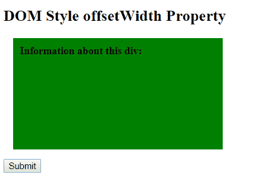
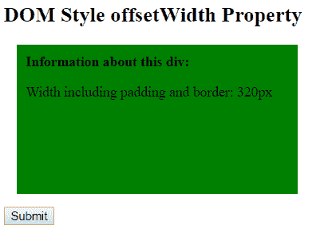
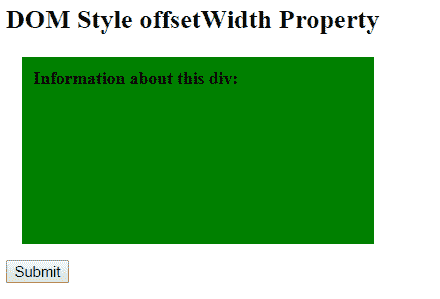
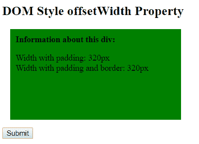

# HTML | DOM 外网属性

> 原文:[https://www . geesforgeks . org/html-DOM-offsetwithts-property/](https://www.geeksforgeeks.org/html-dom-offsetwidth-property/)

**DOM offset with 属性**用于以整数形式返回元素的布局宽度。它以像素为单位。它包括宽度、边框、填充和垂直滚动条，但不包括边距。如果元素被隐藏，那么它返回 0。

**语法:**

```html
element.offsetWidth
```

**返回值:**以整数形式返回元素的布局宽度。

**例 1:**

## 超文本标记语言

```html
<!DOCTYPE html>
<html>

<head>
    <title>
        DOM Style offsetWidth Property
    </title>

    <style>
        #GFG {
            height: 150px;
            width: 300px;
            padding: 10px;
            margin: 15px;
            background-color: green;
        }
    </style>
</head>

<body>
    <h2>DOM Style offsetWidth Property</h2>

    <div id="GFG">
        <b>Information about this div:</b>

        <p id="demo"></p>

    </div>

    <button type="button" onclick="Geeks()">
        Submit
    </button>

    <script>
        function Geeks() {

            var element = document.getElementById("GFG");

            var txt = "Width including padding and border: "
            + element.offsetWidth + "px";

            document.getElementById("demo").innerHTML = txt;
        }
    </script>
</body>

</html>
```

**输出:**
**之前点击按钮:**



**点击按钮后:**



**例 2:**

## 超文本标记语言

```html
<!DOCTYPE html>
<html>

<head>
    <title>
        DOM Style offsetWidth Property
    </title>

    <style>
        #GFG {
            height: 150px;
            width: 300px;
            padding: 10px;
            margin: 15px;
            background-color: green;
        }
    </style>
</head>

<body>
    <h2>DOM Style offsetWidth Property</h2>

    <div id="GFG">
        <b>Information about this div:</b>
        <br>

        <p id="demo"></p>

    </div>

    <button type="button" onclick="Geeks()">
        Submit
    </button>

    <script>
        function Geeks() {
            var element = document.getElementById("GFG");
            var txt = "";
            txt += "Width with padding: "
                + element.clientWidth + "px<br>";

            txt += "Width with padding and border: "
                + element.offsetWidth + "px";

            document.getElementById("demo").innerHTML = txt;
        }
    </script>
</body>

</html>   
```

**输出:**
**之前点击按钮:**



**点击按钮后:**



**支持的浏览器:**T2 DOM offset with 属性支持的浏览器如下:

*   谷歌 Chrome
*   微软公司出品的 web 浏览器
*   火狐浏览器
*   歌剧
*   旅行队